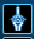

## 功能概述

本功能的仅限于光启亚比计算伤害使用，其它时代亚比由于伤害计算公式与光启时代亚比不完全相同，因此不能完全适用于该伤害计算器。该伤害计算器采用的数字格式是小数，而不是百分数，使用时请注意数字格式的转变。

下面介绍应该如何计算具体各项加成数值。其中10.伤害加成、11.爆伤加成、12.数值加成3部分较为复杂且具有争议，误差和实际相对较大。

欢迎对测算奥拉星pve伤害数值感兴趣的奥拉星玩家针对加成计算公式提出具体的修改意见。

## 穿防收益

计算公式:
$$Y = \frac{1}{1-X}$$
X＝龙神/天堂之剑具体数值。


该技能攻击时无视目标xx%普/特防值

## 克制关系

只和系别与印记养成有关。

- 普通克制=2
- 普通克制+满印记=2.8
- 绝对克制=3
- 普通克制+满印记=3.8

（局外）
（局内）取固定值2.8/3.8。

## 克制倍率

计算公式:

```
Y=1+群星之羽加成+驻场辅助加成+自身加成
```

（具体克制倍率加成数值看局外群星，满配为150%，固定取值150%即可）

- **驻场辅助加成**: 星环师或其他类辅助，加成较为固定，一般为120、100、75、0%。
- **自身加成**: 自身加成类克制倍率极少，一般为100%或计0，建议直接计0。

克制倍率可简化为固定值：2、2.2、2.5、3.5、3.7。非星环师取2.5，星环师取3.7即可。

## 面版攻击

局外面板的技能对应攻击种类的数值。


普攻技能参考普攻数值，特攻技能参考特攻数值，看面板读数添加。

## 技能威力

以所需计算技能的技能威力数值为准，如果有威力系数提升需乘以对应威力系数加成。

(局外)
（局内）

## 属性等级

计算公式:

$$y = \frac{\mathrm{att\_effect}}{\mathrm{def\_effect}}$$

其中:

$$\mathrm{att\_effect} = \frac{4+x}{4}$$

$$\mathrm{def\_effect} = \frac{4}{4+z}$$

其中 `x` 为我方攻击属性等级，`z` 为敌方防御属性等级。

属性等级为12级属性差时，数值固定为6.25。

## Boss防御

以需要挑战的boss单位的数值为准。木桩防御一般为400万的整数倍，建议取1200万。

## 技能段数

以所需计算技能的技能攻击段数为准。攻击目标2/3/4/5/6/7次。

## 威力加成

计算公式:

```
1+buff1+buff2+魂卡加成+晶钥加成+技能自带加成
```


- **buff1**: 威力提升（提升值=80、150、200、300、400%）
  

- **buff2**: 威力祝福，技能威力提升，上限值=150、200、250%

- **魂卡加成**: 威力+[......]，上限值=60、80、90、100%。该部分描述过多且有双重判定方式，以及pve翻倍类字眼，建议直接取默认值90%。

- **晶钥加成**: 与配置有关，计0。

- **技能自带加成**:
  
  该技能威力+100、150、200、300%

## 伤害加成

### 输出本体

计算公式:

```
1+魂器+神兵+召唤师+魂卡+伤害提升+该技能伤害
```

- **魂器**:
  
  首次上场获得伤害提升·魂，提升值=60%

- **神兵**:
  
  首次上场获得伤害提升·神兵，提升值=100%
  首次上场获得伤害提升·神兵，提升值=60%

- **魂卡**:
  
  （魂卡）均视配置而定，极少用，视为0，可不参与计算。

- **召唤师**:
  
  召唤师技能界面，造成伤害+50%（直接计+50%）

- **伤害提升**:
  
  buff，伤害提升（100、200、300、400%。

- **技能自带加成**:
  
  该技能伤害+100、150、200、300%。

可简化为 `1+60%+100%+50%+0%+伤害提升=3.1+伤害提升+该技能伤害`

### 局内辅助

计算公式:

```
虚识+辅助（龙王/黑翼/版本之子）
```

- **虚识**:
  
  虚识，50%全技能伤害加成。

- **辅助**: 视阵容而定，不固定。
  
  龙之战吼，伤害+150%
  
  鲜血祝福，伤害+200%
  版本之子，xx·攻，伤害提升300%（与buff伤害提升分开算）

- **伤害祝福**:
  
  技能伤害提升，上限值=200、350%（一般可忽略）

可简化为 `50%+辅助=0.5+辅助`

### 总伤害加成

计算公式:

```
总伤害加成=输出本体+局内辅助
```

可简化为 `3.6+伤害提升+该技能伤害+（辅助）`

## 爆伤加成

- **61带冰雪女皇一般为**: `200%+爆伤面板+魂卡加成+输出自带爆伤`
- **42带冰雪女皇+孟婆/炽天使一般为**: `400%+爆伤面板+魂卡加成+输出自带爆伤`

（局外爆伤面板）

- **魂卡加成**: 计0
- **输出自带爆伤**: 有且仅有两项，爆伤提升、该技能爆伤
  - **爆伤提升**:
    
    （100%、200%、300%）
  - **该技能爆伤**:
     +100、150、200%

简化为：`200/400%+150%+爆伤提升+该技能爆伤`

## 数值加成

计算公式:

```
1+封神决+群星+神兵+星梦+晶钥+魂卡加成
```

- **封神决**:
  
  全属性能力值提升，默认70%

- **群星**:
  
  群星界面
  
  ，默认80%

- **神兵**:
  
  (数值提升神兵，简便计算可视为0、10%、15%)

- **星梦**:
  
  全属性能力者临时提升，提升值=40、50%，上限值=100、112%

- **晶钥**:
  
  进入战斗后，自身xx能力值临时提升，例6、10%）

- **魂卡加成**:
  
  特攻/普攻能力值+xx%，基础能力值加成作用于面板，不要重复计算

若为英雄亚比则额外+50%，若否为英雄亚比则额外+0%。
