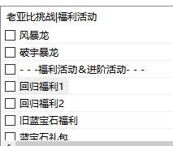
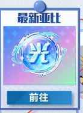
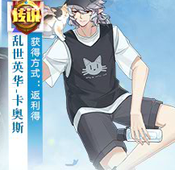
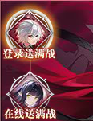

# 免费装备篇

## 部分神兵和圣火炽天使专属

- **场景入口:达人王→奖励兑换→神兵钻装自选**
- **获取方式:350达人币兑换,炽天使在最后一页**
  :::tip
  **推荐兑换顺序:炽天使 (4v2核心辅助)>欧若拉/洛羲 (常用)**
  :::

## 部分光烬亚比专属

- **场景入口:舰队→舰队商店 (需要舰队商店达到3级)**
- **获取方式:1500舰队贡献一件,一套需要6000贡献**
  :::tip
  **推荐兑换顺序:岁岁祈>芙蕾雅>其他**
  :::

## 版本之子始祖冰龙、阿努比斯、沙悟净王者专属

- 场景入口: h5→亚比挑战→其他挑战→头领战→库巴挑战→去挑战→免费获得专属钻装→领取星之秘钥
- 获取方式:使用星之秘钥兑换(星之秘钥收集亚比获得)
- 推荐先换这三位,剩下的换喜欢的,都是老亚比

## 群星之羽亚比王者专属

- **群星亚比:琳琅、图灵、洛兰、冰罗皇、凌风等**
- **获取方式:域界降临→商店兑换→流星之子**

## 某些光启亚比王者专属

- 场景入口:光启殿堂→光启专属钻装祈愿
- 获取方式:使用祈愿石抽取
  :::tip
  **注**全是老亚比,大概率抽不出一整套,但概率获得钻装继承券,装备继承时可以减免50星币
  :::

## 某些光启亚比(猪八戒,沙悟净)王者专属

- 场景入口:蓝宝石要塞→蓝钻兑换商店
- 获取方式:使用蓝钻兑换(不推荐,蓝钻可以到my的旧蓝宝石福利里换取星辉132或其他一部分星辉亚比的王专,用于继承秘宝)

## 某些光启亚比王者专属 注:难度高,池子新,可星币重抽

- **场景入口:挑战试炼→幻想史诗**
- **获取方式:挑战完成后抽取一套随机王者**

## 混沌寂烬-厄瑞玻斯异界满战

- My登录器的拓展-辅助功能-扩展-旧活动列表
  

往下拉找到回归福利1 点击

游戏内点击弹出页面左下角1折商店按钮

点击变换后的的页面上方新手指引按钮

点击前往

点击此处

点击此皮肤跳转

点击此活动

右边即可领取免费异界满战

获取方式: 如图 无需回归身份也可

## 生于哀苦之花-莉莉丝异界满战

场景入口:同厄瑞玻斯

获取方式:如图 无需回归身份也可

## 当月版本之子王者专属

场景入口:挑战试炼→时光副本→时光扭蛋机

获取方式:完成进度获得

:::tip
**附:常见的购买专属方式**

- 直购(只建议买低于199的或年费等特殊亚比)
- 钻装连环购(折扣看运气,一般前几个有较优惠折扣时可以购买)
- 专属小店(杀熟,一般低于1.5折可考虑)
- 特惠异界进阶(156星币一套)
- 一些送亚比活动,可能99星币王者满战/50星币异界升王者
- 一些卖场活动,可能可以使用代币抵扣星币,或低价购入专属

另外,不时会有赠送专属/免费进阶的活动,及时关注
:::
