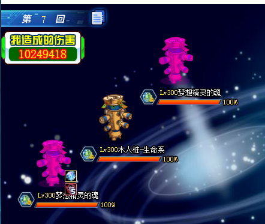
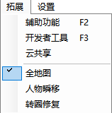
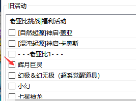
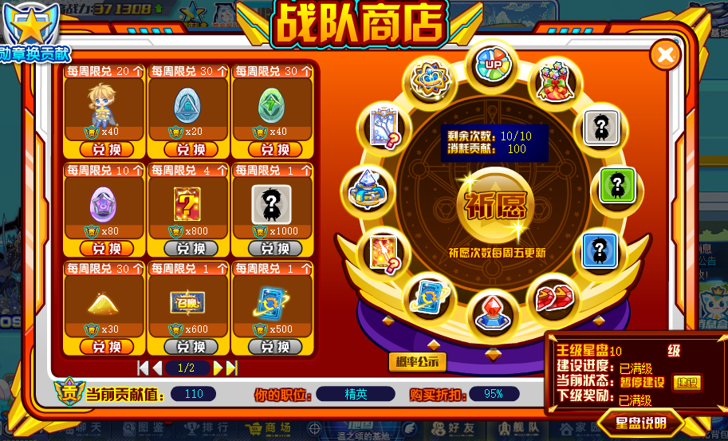

# 附录

## 附录1：目前可以借亚比的boss挑战

**相对重要的亚比加粗显示.找不到挑战可能是暂时绝版了**

- **头领战(6v1)**
- **二代女帝**,乾坤,巫山神女,莉莉丝,**炽天使**,盘古,承影,克希拉,五代赫,四代赫,弗丽嘉,**使者**,源,**龙阿卜苏**,莫邪,白梅比乌斯,不朽洛兰,赤霄,天命王,以撒,圣修暗凯帝,维纳斯,亘古树灵,尼德霍格,提亚玛特,通灵王,可兰,沫夏,死神弥尔最终战,东皇太一,皮塔,一代女帝,帝皇龙,**二代黑翼**,米迦勒,辅助羲和,纯均,湛卢,无祸女皇,太阿,尤尼梅特,玄皇,**密潘**,二代修罗,七星龙渊,海纳百川,二代狼王,**狂龙**,鹤顶红,光烬真理之后,始祖影龙,莱特若希,**英雄天使王**,夹竹桃,**唤灵圣天伊,**绝情丹,**哪吒**.
- **双宠战(4v2)**
- 光烬姬露比,法芙娜,炽寒双凤,光烬梦,**英雄奇灵王**,二代麒麟,**至高阿赖**,**至高银河**,二代洛羲,**至高龙母**,**光烬艾琳**,**唤灵盘古**,**天女**,**六代赫**.
- **单挑战**
- 陨灭-世界,末那,波旬最终战,光烬夜兰

:::tip
师徒可以借一个,好友可以借一个,挚友(暑期福利)可以借两个,总共4只亚比,**可以借出一整个4v2队,建议趁着暑假赶紧把4v2能借亚比的都打了.**如果不是新手/回归,不可以借用好友的亚比.
:::

:::tip
亚比的魂卡、魂器等会随时更新,因此建议和大佬沟通好借什么亚比.借来的群星用的是自己的群星点.前期推荐借用亚比为常用的强力C,包括渡、唤灵星诺玛、阿比斯、秘宝132、菠萝、星龙等,在群里找大佬借即可.
:::

## 附录2：清持续亚比和清数值亚比汇总排行

- **指的是那些999回合的buff(如星梦、龙潭等),持续回合数＜10的找个亚比带贤者的反击就能清掉了(如132的永恒之力、贝利亚的炼狱等).光启的kk上场可以清对面的持续回合数＜10的增益,二代凯撒阵亡也可以.**
- **唯一真神**
- **1.异次元女娲**
- 使用方法：只要不首发,**替换上场直接清对面全场持续**,**无需专属,但需要被动技能满级**
- **获取方法：**场景搜索女娲殿298星币获取 / 异次元盲盒
  :::tip
  清持续效果也会清除**我方辅助挂的debuff**,因此推荐首发群星替换为她.
  :::
- **T0**
- **1.通灵刘备**
- 使用方法：上场大招清单体(必须命中才可以)**无需专属**
- 获取方法：异次元召唤阵通灵周抽取 / 异次元盲盒
- **2.超维盘古**
- 使用方法：**挨打或者开大**清对面持续,**需要专属**
- **T1**
- 奥义天使银
- 使用方法：开局放超奥义,**挨打**高概率清其单体(怕一直复活)
- 获取方法：找大佬乞讨,需要**5000**亲密度**无需专属**
- 异次元车厘子 使用方法：属性技清全场**无需命中**
- 超元凯撒 使用方法：属性技清全场**无需命中**
- **T2**:
- 奥义轩辕: 使用属性技[血荐轩辕],3回合内对方使用能摸到自己的技能,则清其单体
- 神启黑坤: [玄虚六合] 清单体(怕未命中)
- 神化无冕: [无名双影] 回合末清单体(怕未命中)
- 传奇战火之王: 属性技[战意斩杀]清单体
- 奥义哈迪斯: 属性技[灵魂重置]清单体
- 回响乾达婆: 小技能+属性,可清全场
- **T3**:
- 传奇修凯: [圣光惩戒] 清单体(这位是个瞎子,会未命中)
- 王者哈迪斯: 攒够4元气开大招[万冥天罪]清单体
- 传奇盘古: 开领域后[开天圣斧]清单体(该技能必中)
- 混沌天使王: 攒够3星开大招概率清单体 (专属给了个首次上场首回合无敌,穿上更好,可以用来保命)
- 奥义帝皇龙: 速度等级比对面高的前提下,属性技[杀意无双]回合末清单体(寒暑假buff下可直接使用此技能,其他情况先开奥义削对面速度再开属性)
- **T4**:
- 传奇炽天使K: 攒够5魂开大招清单体(攒半天没攒好)
- 奥义幻星狼神: [离久天流]低概率清单体(该技能必中,但概率实在感人)

:::tip
清持续清的是buff,和清数值不一样.
:::

:::tip
清数值亚比只能清对面提升的数值,包括星梦和关卡buff等.
:::

:::tip
推荐使用异次元[自然起源]神启盖亚,my的旧活动列表可获取,上场即可触发清数值效果,但需要被动满级.也可以首发使用属性技能.星辉的清音妙律·乾达婆同理,带专属可以上场清数值,没有则需要手动使用属性.
:::

:::tip
如果没有,也可以使用异次元超维亚比,名字一般为[xxxx]超维xx,每回合末清除对方提升的数值.
:::

## 附录3：部分星辉/异次元亚比的pve作用

- **相对重要的亚比加粗显示.**
- 星辉SSS亚比
- 1神灵愚者：专属装备无效boss属性五回合,上场刷新
- 2贤者的悲歌·L：五星斩杀25% 打光启99真抗只能打10w
- 3 轮回无冕：专属装备限伤
- **4 战意骸：专属上场触发属性,无效boss技能**
- 5 神灵东皇：属性技能封印全场六回合属性技能无效,敌方属性等级及数值无法提升,我方无法下降,专属上场触发属性技能
- 6神灵凤凰：高级复活,切换上场刷新神灵等级
- 7 聚元女娲：同贤者的悲歌·L
- 8 战意时空王：自身死亡后为下一只上场的亚比加复活buff,不吃专属
- 9 Sp梦：属性技能可以辅助降低boss双攻
- **10 清音妙律·乾达婆：重置敌方能力值,可用于清数值/配合亚当**
- **11 直抵未来之辰星·通灵梵天：属性技能根据全场亚比数,持续为我方全场提升数值和属性等级,召唤龙皇可以提升我方暴击率 专属上场开属性技能**
- 12 神灵奇灵王：受击削弱boss数值
- 13 神灵盖亚：二级神灵无限回满状态,专属保护血量上限
- 14 混沌天使王：大招概率清光启boss被动,专属上场首回合免疫所有技能,封印三回合属性技能
- 15 正逆宙斯：五星无效光启亚比3回合所有技能
- 16 未来盾护双狗：低星扣血buff 需要专属
- 17 真理之后：双宠战持续降低敌方全场全属性等级
- 18 战意女帝：被动腐朽之花少量固伤
- 19王者黑翼王：无限叠加体力上限21e
- **20 天帝昊天：上场锁定全场属性等级及属性数值,无法提升和下降上场3星可用玄霄归位技封属5回合**
- 21 魔君夜渊：测试boss能力值 已淘汰
- 22 传说时空王：被动上场生效,禁止敌方全属性数值提升
- 23 sp露易丝：同传说时空王
- 24远古精灵王·伊撒尔：属性受击降低boss当前百分比的体力上限
- 25王者羲和：在场每回合降低boss 5000体力上限
- **26王者孙悟空：被动错乱,我方全体生效,配合瓦格纳的属性技能杀穿羁绊塔**
- 27 初代归位梦: 有专属情况下开局用分析,可以封属,对于第一回合必定开属性的boss(如渡)可以封属长达15回合
- 28 美杜莎：配合决斗回转扣,概率很低,不建议用
- 29 阿赖耶识：逃课部分挑战
- 30 零阶-愚者：光年宝石配合亚当吸数值
- 星辉SS亚比
- 1冰罗皇：属性技能禁止敌方6回合提升属性等级和数值,保护我方6回合属性等级和数值,专属上场触发属性技能
- 2 神力龙母：同传说时空王
- **3 星辉晴明：不死挂机拉魂**
- **4 星辉姜子牙：五星禁止回复 无限回合 吸取数值**
- 5 洪荒王：专属降低全属性数值最高50%可配合光启姜子牙被动同时生效
- 6 混元合一·奇灵王：被动受击一次扣除当前10%全属性数值,最多三次 专属一次扣15%,上限45%
- 7 荒宇生无极·东皇太一：属性技能五回合封属
- **8星辉逍遥：化解,无限回合**
- 9 四界共主·乾坤：无条件错乱
- **10 永坠星域·星魔：无限回合固伤,挂机/大扣血**
- **11 红羲和：无限回合爆伤和吸血**
- 12 醉红颜·洛洛离：我方全场免疫停止行动
- 星辉S亚比
- **1 敖兴：限制伤害**
- 2 花冠公主：自爆提升后续上场星辉亚比血限
- 3 夏队：下场续命buff
- 4 芒种：属性技能保护血量上限可继承
- 异次元亚比
- **1 异次元晴明：不死挂机拉双魂 一定不要升级系统**
- **2 超维凯撒：减真抗(通灵132可以召唤,召唤位受攻击概率更低)**
- **3 异次元女娲：清持续**
- **4 通灵亚当：吸数值逃课**
- **5 双生双狗/乾坤：大扣血(任意双生亚比均可,但这两个上场满元气)**
- **6 灵魂天命王：拉双魂;记录目标全属性等级和能力值,目标每次扣除体力重置至记录值的最低值.**
- **7 [混世魔童]哪吒：减伤,域界逃课(需要拆一件专属)**
- **5.其他亚比**
- **梦想精灵：20%重置全场属性和状态,配合异次元亚当吸数值逃课;配合星辉子牙重置星辉boss**
- **传奇宙斯：70%翻转全场属性技能,配合瓦格纳重置非光启的boss.(需要年费)**

:::tip
还有一些比较好玩但**实战意义不大**的亚比,因此不再列出.
:::

## 附录4：通灵亚当逃课教程

- 通灵亚当**直接扣除体力,无视免疫固伤和免疫非克制伤害,可以6v1逃课**
- **1. 亚当梦想精灵队伍(高速,不稳定,最实用)**
- **队伍人员**：
- **基础版**：灵魂亚比 光启归零者 梦想精灵 逍遥 亚当
- **进阶版**：灵魂亚比 光启归零者 梦想精灵 逍遥 异次王者羲和 亚当
- **亚比作用**：
- **灵魂亚比(拉魂)**：**异次元灵魂亚比拉双魂能吸两个魂的数值**,首选推荐晴明,没有其他灵魂亚比也可.
- **光启归零者**：上场清空对面光能,保证逍遥稳定切走;**离场给对面全场上一个能被梦想精灵清除的debuff,能变相提高梦想精灵重置概率**,**让梦想重置的魂变为100%血的死魂,能吸更多数值 (异界可用,1级最好)**
- **梦想精灵(死魂)**：**回忆泡沫技能重置全场,能把魂重置成死魂,死魂是pvp单位**,一些对boss无效的变态技能此时便可以发挥原本作用.
- **逍遥(保护)**：保护梦想精灵,保护亚当
- **异次元王者羲和(重置)**：因为亚当会吸数值导致吸的魂数值会流失不少,通过**羲和挂的时离标记可以让魂重新回到高数值状态,提高亚当的吸取效率.**
- **没有可以换星辉年费愚者,利用光年宝石加快吸取数值.**
- **通灵亚当(吸数值)：吸取死魂的数值,通过吸取的大量数值**,每回合通过自身被动**无视锁血吸取敌方亚当自身全属性之和x15%**的血进行跨时代输出
- **操作流程**：
- 第**1**回合：灵魂亚比上场使用**超元气·狩**拉魂
- 第**2**回合：灵魂亚比切换归零者
- 第**3**回合：归零者切换逍遥
- 第**4**回合：逍遥切换梦想精灵
- 第**5**回合：梦想精灵使用回忆泡沫**打本体**直到出100%血死魂
- 第**6**回合：梦想精灵使用回忆泡沫**打本体**直到出100%血死魂
  

:::tip
一般一把也就**2-3**次使用回忆泡沫的机会,如果**2-3**次回忆泡沫厚没有出死魂,重开即可
:::

- 第**7**回合：出死魂后切换逍遥
- 第**8**回合：切换亚当(有羲和的切换羲和)
- 第**9**回合：使用天命唯我打一次死魂吸取血量提高战场能力
- 第**10**回合：使用救世召唤吸取数值直到魂死
- 第**11**回合：使用救世召唤吸取数值直到魂死
- 第**12**回合：魂死后随便使用天命唯我/救世召唤即可

:::tip
梦想精灵打异次元灵魂有概率被化解,建议直接打本体.技能中了之后重置灵魂为死魂还要计算一次20%概率,挂一个能被清除的buff可以提高概率.
:::

:::tip
亚当契通灵推荐首选：夏娃(体力>80%获得90%真抗).夏娃不必须,没有的话其他也可以,可以绝界周异次元召唤阵抽取.梦想精灵要升到60级学习回忆泡沫技能.
:::

:::tip
光启归零者可以替换为其他给敌方全场挂长回合数debuff的亚比.如果没有,会重置敌方魂为0血魂,无法技能选中但可通过代码选中,但是较复杂.
:::

:::tip
亚当**不要使用牺牲技能**,会重置吸取的属性
:::

:::tip
亚当下场后会重置吸取的数值但**保留吸取的体力上限**
:::

- **2. 亚当 通灵无冕 队伍(最低配,低速,稳定)**
- **队伍人员**：
- **通灵无冕版**：逍遥 异次元晴明 光启归零者 通灵无冕 逍遥 亚当
- **亚比作用**：
- **异次元晴明(拉魂)**：**异次元晴明拉双魂能吸两个魂的数值**,**由于需要站场**,因此要万血.**逍遥首发切晴明可以保证晴明不反弹伤害,从而保留两个1%血魂.使用其他灵魂亚比则要配合异次元塔王站场(替换归零者)**
- **光启归零者**：上场清空对面光能,保证逍遥稳定切走.\*\*\*\*
- **通灵无冕**：**使目标受到的伤害延迟至回合末结算,阵亡后使亚当上场不会扣魂血量,从而保证可以吸2个1%血魂的数值.可以my的旧活动列表获得.**
- **操作流程**：
- 第**1**回合：逍遥切换异次元晴明
- 第**2**回合：异次元晴明上场使用**超元气·狩**拉魂
- 异次元晴明吃药站场至魂只有26%体力
- 第**8**回合：异次元晴明切换逍遥
- 第**9**回合：逍遥切换通灵亚当
- 第**10**回合：通灵亚当吃药
- 第**11**回合：通灵亚当使用爆发技斩杀1%血魂吸取体力上限
- 第**12**回合：通灵亚当切换逍遥
- 第**13**回合：逍遥切换异次元晴明,并再次拉魂
- 异次元晴明吃药站场至魂只有26%体力
- 第**18**回合：异次元晴明切换归零者清空光能,归零者阵亡切换通灵无冕
- 第**19**回合：通灵无冕吃药即可,阵亡后切换通灵亚当
- 第**20**回合：亚当通灵召唤,吸取双魂全属性能力,之后随便使用天命唯我/救世召唤即可
- **只能吸一次魂的数值,但是可以吸双魂,造价更低且更稳定.**

- **3. 亚当 3S乾达婆/通灵无冕 队伍(中速,稳定)**
- **队伍人员**：逍遥 异次元晴明 3S乾达婆 通灵无冕 亚当 异次元尤莱亚
- **亚比作用**：
- **异次元晴明(拉魂)**：**异次元晴明拉双魂能吸两个魂的数值**,**由于需要站场**,因此要万血.**逍遥首发切晴明可以保证晴明不反弹伤害,保留两个1%血魂.**
- **3S乾达婆：重置魂的体力值至上限,需要专属**
- **通灵无冕**：**使目标受到的伤害延迟至回合末结算,阵亡后使亚当上场不会扣魂血量,从而保证可以吸2个1%血魂的数值.可以my的旧活动列表获得.**
- **异次元尤莱亚：每回合末给敌方全场挂冰冻,加快魂扣血**,**副本可获得.**
- **操作流程**：
- 第**1**回合：逍遥切换异次元晴明
- 第**2**回合：异次元晴明上场使用**超元气·狩**拉魂
- 第**3**回合：异次元晴明切换尤莱亚(boss本回合打死尤莱亚则重开)
- 第**4**回合：尤莱亚切换晴明
- 第**5**回合：晴明切换逍遥
- 第**6**回合：逍遥切换通灵亚当
- 第**7**回合：通灵亚当使用爆发技斩杀1%血魂吸取体力上限
- 第**8**回合：通灵亚当切换晴明
- 第**9**回合：晴明再次拉魂
- 第**10**回合：异次元晴明切换为乾达婆触发重置体力值
- 第**11**回合：乾达婆阵亡切换为通灵无冕
- 第**12**回合：通灵无冕阵亡切换为亚当
- 第**13**回合：亚当通灵召唤,吸取双魂全属性能力,之后随便使用天命唯我/救世召唤即可**只能吸一次魂的数值,但是可以吸双魂,成型更快更稳定.**

- **4v2阵容：异次元晴明+战意骸+3S乾达婆+通灵亚当 较脆,需两套专属**
- 第**1**回合：晴明使用**超元气·狩**拉魂,战意骸切换为乾达婆
- 第**2**回合：晴明切换为战意骸,乾达婆切换为通灵亚当
- 第**3**回合：亚当救世召唤吸取数值
- **另一边重复晴明拉魂-战意骸保护-乾达婆重置-战意骸保护**
  :::tip
  亚当需坚毅铭文和高体力,蓝九最好,没有就咸鱼套.并需要一定运气.
  :::

## 附录5：4v2大扣血逃课简介

- **队伍人员：战意骸+永坠星域·星魔+两只双生亚比**
- **原理：当一只双生亚比的分身阵亡后,另一只双生亚比再分身,将会卡出一个无法被选中的分身**.boss和我方均不会行动,但回合仍会继续,由于战斗限制回合数是通过使我方亚比体力重置为0实现,但卡出来的分身无法被选中,因此可以**无视关卡的限制回合数**,从而利用星魔无限回合的固伤将boss扣死.
- **亚比作用**：
- **战意骸(保护)：保护双生亚比.专属,4v2保护能力最强,没有可换为逍遥.**
- **星魔：固伤.有专属上场即可,没有专属需要逍遥保护释放技能叠毒.**
- **双生亚比：卡bug.首选原罪双狗(上场可分身)和双生乾坤(上场可分身),其次双凤(可复活),其他的双生亚比理论可行但是不如这三个好用.**
- **操作流程示例：较灵活,不局限于这种顺序.假设使用双狗和乾坤**
- 第**1**回合：双生亚比A分身,双生亚比B替换为星魔,星魔如被打死替换骸
- 第**2**回合：双生亚比A使用小技能,骸替换为双生亚比B
- 第**3**回合：如果双生亚比A的分身已死,双生亚比B分身
- 之后将等待其他亚比被打死即可.有时候扣到一定体力就会结束战斗.

:::tip
部分关卡的免疫非克制buff在999回合后就会消失,可以使用大扣血.
:::

:::tip
不要两只亚比一起分身,不要分身后又使用超元气合.
:::

:::tip
6v1也可以使用,但刚需阿比斯.
:::

## 附录8：evp出生榜汇总及应处理方法

- **统计范围：evp比较常见的、容易阴人的.不统计专属,带专属的更出生**
- **1. 旧技能组：技能组往往缝合了很多的特效,打的时候很容易翻车.**
- (1) 寰宇鎏金星河入怀-银河(湮灭系)：乱魂
- 大招赋予亚比乱魂,60%命中错误目标
  :::tip
  处理方法：使用my计算光能,确认其不使用大招再输出
  :::

- **(2) 三位一体-至尊精灵王(超神秘)：封印、冻结**
- **上场获得2+目标背包亚比数的光能,大招逼退并禁止目标上场若干回合,回合数=目标背包亚比数.属性技能概率上冻结,20%无法行动.**
  :::tip
  处理方法：首发子牙**化解封印;**群星多站几回合把封印吃了\*\*再上主C.
  :::

(3) 深渊安魂曲-奈亚(完全系)：特殊机制、乱魂、雷击

上场赋予任意目标深渊印记(可传递),吞噬自身及有深渊印记的目标的全属性值与能力变化;大招乱魂(50%命中错误目标);连锁技雷击(30%停止行动).

:::tip
处理方法：使用清持续亚比;使用星辉神灵亚比让印记挂到神灵上;4v2多试几次,让印记别挂到要切换成主C 的亚比身上.
:::

(4) 千山落樱之辉-夜樱(虚境系)：高固伤、沉眠、恐惧

小招一次沉眠;大招伤害特别高,还有高固伤和恐惧.最近不那么常见了,

:::tip
处理方法：61正义群殴,龙王保护;单挑使用针对性亚比尽快击杀.4v2出场不多,遇到了建议多试试,优先击杀.
:::

- **(5) 破虚空衍群龙-龙母(超神秘系)：化解、高固伤、斩杀**
- **被动梦之纱根据消耗的光能概率免疫技能,对五光大招免疫概率为70%**
- **首次使用攻击技能获得龙潭：50%回合末反弹受到伤害的50%,上限20000**
- **大招最多扣除30000固伤,且造成伤害后斩杀体力低于20%的目标**
  :::tip
  处理方法：使用清持续亚比/使用不耗光能的输出,芙蕾雅、神羲和、阿比斯等
  :::

:::tip
龙潭可以通过贤者的反击/kk对位清除,大招只能说注意自己的血量吧
:::

- **(6) 圣树临辉光暗双耀-奇灵王(超电系)：快速削属、雷击、削弱体力上限**
- **每次受到攻击削弱3级属性;小技能30%将随机属性削弱至与自身相同;3级雷击(30%无法行动)4回合;每次攻击前3次攻击削弱5%体力上限,光烬可吸取20%体力上限、削弱2级全属性.小技能最多一回合21000固伤.**
  :::tip
  处理方法：女皇开保护属性;4v2可以用双天或圣天伊、盘古等快速击杀\*\*
  :::

(7) 天国守护者-白天使王(超王系)：高伤害

一手无视80%特防刀刀真伤

处理方法：单挑遇到使用启元赖,波旬等处理;61有龙王保护,正义群殴

(8) 睥睨众臣-女帝(超时空系)：开局灵佑、神佑、乱魂

开局保护等级和能力值;首次攻击乱魂(40%).

:::tip
处理方法：\*\*女皇无视护属降低属性;至高荣耀需要站场4回合;等乱魂结束了再打或者直接拼脸.
:::

(9) 武绝凌天-貘(完全系)：回合末高固伤、斩杀

每回合扣除全场固伤,上限(10000+我方背包未阵亡亚比数/2,最多30000),大招斩杀体力低于20000,否则扣除20000固伤

:::tip
处理方法：\*\*尽快击杀并注意站场辅助的血量
:::

- **(10) 棋临无间-无冕之王(超王系)：化解**
- **概率免疫攻击技能,概率=[自身速度种族值-目标种族值]\*1%**
  :::tip
  处理方法：使用清持续亚比;女皇带精准神兵;主C用速度种族值高的或自带精准的,比如英雄亚比.\*\*
  :::

- **(11) 漆夜破空之刃-使者/漆漆-使者(虚境/超时空系)：记忆修改、高伤害**
- **新晋出生榜榜首亚比,一手先发的幻化清梦属性技赋予记忆修改,随机释放技能**
  :::tip
  处理方法：6v1可使用宙斯等五光打手,因为光启爆发技＞先发小技能,可以无视幻化清梦.4v2可使用：渡、潘多拉之类亚比,或者高伤害直接短时间处理掉提高容错.被打死了只能说运气不好,多试试吧.\*\*
  :::

- **(12) 万王天谕-圣王麒麟(超王系)：逼退、雷击、高固伤**
- **一手出生逼退给人当皮球踢,还有雷击和高固伤**
  :::tip
  处理方法：不要带死不掉的亚比,防止逼退,带群星就首发吃药送死.如果对面数值较低,也可以带域界给的防逼退魂器.\*\*
  :::

- **(13) 天地惊弦-六龙圣王(超王系)：异常、逼退**
- **靠一手大招异常折磨人,还有个逼退**
  :::tip
  处理方法：顶着异常打就行,不要带死不掉的/群星首发吃药送死\*\*
  :::

(14) 圣铃妙音-阿赖耶识(虚境系)：反击、固伤

阿蒙王必吃榜.25%反击,每次反击还扣固伤.

:::tip
处理方法：\*\*能用其他阵容时就别用阿蒙了.推荐快速击杀,辅助在收集能量进入cd时候吃药,不要乱动,或者多试试.
:::

:::tip
**没有详细说明处理方法的都建议优先击杀,或者顶着硬打,或者多试试**
:::

- **(15) 傲凡尘启仙灵-女娲(仙灵系)：血禁、高固伤 处理方法：多试**

- **(16) 超越纪元的新生-海蒂拉玛(超数码系)：高伤害、高固伤、无光**
- **双圣魂之一,圣魂斩杀是超乾坤系的,打人很疼,不建议使用超龙/超光打手.**
  :::tip
  处理方法：6v1可以群星多站几回合等吃到幻想具现再换;4v2多试.\*\*
  :::

- **(17) 万神之王-宙斯(超电系)：罚站、扣光、清增益、高固伤**
- **Evp幻神,一人拥有两种异常：磁场和雷击(可在附录6查看),并且可以额外消耗敌方光能,自身拥有护盾,拥有清增益,大招拥有最多60%穿防.真神出生,只要数值给高点,就是噩梦.**
  :::tip
  处理方法：1.雷击只能赌运气 2.6v1让龙王子牙先上场自爆,女皇使用1光技能保护属性再自爆3.打手推荐使用高数值的圣天伊、盘古、艾琳等快速击杀.\*\*
  :::

- **(18) 造自然耀万物-盖亚(超光系)：恐惧、高固伤 处理方法只能多试**

(19) 神兽尊主-苍穹圣龙(超光系)：玩异常的,还好没逼退

处理方法：顶着异常打,只能多试,记得保证续航,祈祷少吃几个恐惧

- **2. 新技能组 看似是原始人,但是作为boss时也有比较麻烦的**
- **(20) 异界史诗-渡(生命系/不朽系)：较高伤害、固伤、快速提属**
- **一回合两动,会切形态,很影响体验,回合末烧血,伤害还不低.**
  :::tip
  处理方法：**女皇自爆给他,优先击杀.辅助搞肉点.**
  :::

- **(21) 大道无名-天命王(超王系)：大招打全场带高固伤,龙母的好队友**
  :::tip
  处理方法：**女皇/孟婆扣他光,辅助搞肉点,优先击杀.**
  :::

(22) 长夜墟渊-烛龙(超龙系)：大招清弱化 扣光,多试试,优先击杀.

:::tip
**(23) 梵星音律-乾达婆(超光系)：乱魂、星梦、抗性提升**
:::

- **大招赋予亚比乱魂 75%概率命中错误目标.6v1自带全属性和抗性提升**
  :::tip
  处理方法：1.使用清持续亚比 2.算好光能,乾达婆有开大的光能时候注意出招,出招后有乱魂buff不要攻击 3.直接灌伤害秒掉
  :::

- **没有详细说明处理方法的都建议优先击杀,或者顶着硬打,或者多试试**
- **(24) 群星守护寰宇光辉-神银河(湮灭系)：高额固伤,击杀连击,能力值膨胀**
  :::tip
  清持续/优先击杀,如果有专属更恐怖,平时没有.
  :::

(25) 审判命运之战-奥丁大帝(超神系)：清空光能,高额固伤 吃药攒光能

(26) 终末的残响-诺亚(完全系)：有个雷击

(27) 断海沧澜-龙太子(超龙系)：伤害比较高

(28) 审神律理-无冕之王(超王系)：有时候会睡人,大招驱散两个增益

(29) 寒夜破晓之刃-使者(虚境系)：有记忆修改

:::tip
**(30) 神威地龙-摩罗迦(超神系)：会懦弱和失明,降低伤害和命中率**
:::

:::tip
**(31) 境神临之噬-赫耳墨斯/噬界傀人-赫耳墨斯(超暗系/完全系)**
:::

- **evp常客,快速提属,伤害很高.如果两个一起,女皇锁一个,先杀另一个**
  :::tip
  **(32) 灵骸烬染之潮-夜樱(虚境系)：沉眠,斩杀**
  :::

- **evp常客,小技能沉眠,大招先扣固伤再斩杀血量低于10%,专门斩杀阿蒙**
  :::tip
  处理方法：少用阿蒙王或优先击杀
  :::

(33) 月影映斑斓-夜樱(虚境系)：小技能失明,大招沉眠和驱散增益

(34) 风摇影清荷-琉璃(仙灵系)：被动每回合清一个剩余回合＜10的debuff

处理方法：用子牙/圣灵星诺挂弱化就不会被清了

(35) 黑翎之妄朽界之暗-梵天(超暗系)：削属比较快,大招驱散两个增益

(36) 天启纪元缔世圣冕-梵天(超光系)：提属较快,还有个清两项负属性的技能

:::tip
**(37) 横戟破军-吕布(超暗**系**)：嘲讽替换上场的单位,大招恐惧.少用双C打**
:::

(38) 神行至尊-玄皇(超上古系)：束缚,清属性等级 群星首发或带椅子

(39) 诡影噬夜-黑翼王(超圣灵系)：小招驱散一个减益,每回合提升友方双防

:::tip
**(40) 全维衍化之钥-阿比斯(超数码**系**)：独特机制、清增属性**
:::

- **6v1中会把包里最后一个亚比拉出来;4v2中会把不对位的亚比关进小黑屋.剥离之锋会清一项最高的属性,从普攻开始从下往上清.大招驱散增益.**
  :::tip
  处理方法：女皇/群星和她处于对位,别让输出被关了,记得开护属\*\*
  :::

(41) 建构终端-格莉娅(生命系)：大招清两项属性和驱散两个增益,小技能束缚

(42) 圣仪临世-烈焰凤凰(超火系)：灼烧,扣固伤,动的越多扣的越多.

(43) 空寂无尘万法唯心-阿赖耶识(虚境系)：自己和队友每次被攻击都扣固伤

:::tip
**(44) 一桥一诺一相逢-梦(黯星)：削属性较快,大招沉眠.有专属更可怕,梦之纱免疫攻击特效,非常建议清个持续.**
:::

(45) 幽泉使者-孟婆(超暗系)：小技能清空pp,大招失明

(46) 吞天黑潮-凯撒(超暗系)：小技能恐惧,大招清两项属性

:::tip
**(47) 神霆点苍-奇灵王(超电系)：每次受击削3级属性;小技能清属性和雷击.**
:::

:::tip
**(48) 纵马引弓巾帼志-孙尚香(超神系)：挨打反击,小技能清属性,大招虚化一次,75%免疫伤害.伤害被吞了就是打到虚化上了.可以多试或者算光能**
:::

(49) 日辉月影之扉-羲和(超神系)：削属性比较快,大招驱散2个增益

:::tip
**(50) 虚堕之君王-贝利亚(超火系)：新晋出生,上场带炼狱4回合,技能连击一次;神·烈火战马高额固伤,小技能带有恐惧和灼伤.可用贤者的反击清炼狱.**
:::

:::tip
**(51) 七罪圣裁-伊撒尔(超龙系)：新晋出生,开局2回合永恒之力免疫减益,大招伤害不低,小技能带斩杀.6v1造成击杀还会炸背包.**
:::

处理方法：群星首发带锁链吃药站两回合,或者使用贤者的反击等清持续.尽快把属性降下来或使用化解类,减少辅助被132击杀.

(52) 光穹永耀之辉-天使王(超飞行系)：大招有一次虚化

:::tip
**(53) 预命之固伤-瓦沙克(超神秘系)：每回合末扣固伤,剩余体力越少扣的越多;技能打全场还会溅射给队友.辅助一定搞肉点.**
:::

:::tip
**(54) 诡匿之君王-巴拉姆(超格斗系)：新晋出生,小技能会清空自身光能和增益效果,扣除目标等额光能和增益效果;放逐会把2回合内50%伤害在2回合后以固伤形式结算,由于免疫非克制伤害会免疫固伤,相当于直接吃掉50%伤害;大招双攻降低30%,预言成功还会扣1光.建议优先击杀和多试.**
:::

:::tip
**(55) 宙域终域-上古星龙(超上古系)：每回合提属性,大招灵盾一次化解,小技能清除2个减益.带专属还会化解每个亚比第一次技能,非常出生.好在目前出现不多,但是幻想史诗有个一千多万体力带专属的.**
:::

处理方法：每个自爆亚比使用小技能打一下再自爆,可以带两个削属亚比如女皇和孟婆来应对快速提升属性.如果未来在42出现,建议尽快击杀.

:::tip
注：大部分带专属的亚比提升属性和削弱属性都很快,一定要锁属护属啊.
:::

:::tip
遇到莫名其妙的情况建议多看看技能或关卡buff.
:::

## 附录6：晴明万血与挂机攻略

- **Root提供**
  :::tip
  晴明培养**谨记**灵魂系统\*\*千万不要升级
  :::

- 需要携带**体力刀**(带有体力词条的武器).
  :::tip
  **体力刀**获取方法：
  :::

- **My登录器**上方点开**拓展**选择**全地图**并**刷新游戏**
  

地图场景搜索：**英雄试炼城**

进入场景选择魔方迷宫;

里面每日**十次**获得装备的机会(**大概率**出**体力刀**)

获取**体力刀**之后,进行升级**进阶**成**钻装**

- **蓝色**星沙可以通过**分解**其他**蓝色**装备获得
- **紫色**星沙可以通过**蓝色**星沙**合成**获得
- **金色**星沙可以通过**镜像塔**和**战队商店**获得

:::tip
**紫色**进阶星能获取方法：
:::

- **My登录器**上方拓展的辅助功能;
- 选择**辉月巨灵**
- 进入**挑战**(单人和组队挑战一天可获得**90辉月之力**)

用**辉月之力**兑换**紫色**进阶星能(一天限**5**个)

- **金色**进阶星能通过**紫色**进阶星能合成获得;
- **王者**进阶星能通过**战队商店**贡献兑换获得(**周**限**5**个)：
  

:::tip
\*\*其他提高体力值的方法
:::

- **1**.战队或者舰队的**天工树**(局内增加体力上限);
  

- **2.**携带**基础体力值**较高的护符(例如：樱花护符,百星护符等);
  

- **3**.学习力把**体力**拉满;
  

:::tip
如果**已经刷错了**可以通过商店购买**降级喷雾**(**100级**晴明)和各种**遗忘喷雾**遗忘学习力并重新刷取;
:::

- **4**.携带**体力**铭文(尽量多**歪点**体力副词条);
  

- **5.**亚比军团(上限能加**588**点体力值)
  

:::tip
如果经过以上**培养**仍没能达到进入局内**万血**状态,则可以将召唤师技能更改为**巨化**以达万血目的
:::

- **最佳组合：锁血+凯撒+晴明+圣域狗 (4v2) +逍遥+大力神 (6v1)**
- **1**.星辉子牙(有**专属**上场**满星,开大锁血**)
- **2.**大力神将(军团里面开,烧血技能：黄沙狂潮**999**回合)
- **3**.煌炎战神/傲月武神(my旧亚比搞,圣域挂灼烧/冰冻)
- **4**.星辉ss星魔(**专属**上场挂满毒,否则需要攻击挂毒)
- **5**.异次元超维凯撒(站场一回合吸取敌方单体**20%**真抗,未受到伤害则**翻倍,有通灵伊撒尔契约更好**)
- **6**.超奥义炽寒天凤(**超奥义**挂怒火印记到三层爆炸造成固伤)
- **7**.**阴阳百鬼主**灵魂晴明(异次元 不死 上限**9999**次) 6v1推荐使用异次元晴明,星辉也可
- **8**.阴阳主百鬼王·晴明(星辉 不死 上限**9999**次) 4v2推荐使用星辉晴明,异次元也可

:::tip
**星辉**晴明与**异次元**晴明的区别：
:::

- 装备：星辉需要专属,异次元不需要专属
- 拉魂数量: 6v1异次元可以拉两个,4v2异次元拉一个;星辉6v1和4v2都是拉一个
- 拉魂概率：异次元只有消耗元气的技能必定拉出;星辉是每回合末概率拉魂+消耗星的技能必定拉出
- 养成难度：星辉易;异次元难
- 挂机速度：61异次元优;42星辉优.无特殊关卡难度,两者皆可,有什么用什么
- **处理方法：**61正义群殴,龙王保护;单挑使用针对性亚比尽快击杀.4v2出场不多,遇到了建议多试试,优先击杀.

- **(5) 破虚空衍群龙-龙母(超神秘系)：化解、高固伤、斩杀**
- **被动梦之纱根据消耗的光能概率免疫技能,对五光大招免疫概率为70%**
- **首次使用攻击技能获得龙潭：50%回合末反弹受到伤害的50%,上限20000**
- **大招最多扣除30000固伤,且造成伤害后斩杀体力低于20%的目标**
- **处理方法：使用清持续亚比/使用不耗光能的输出,芙蕾雅、神羲和、阿比斯等**
- **龙潭可以通过贤者的反击/kk对位清除,大招只能说注意自己的血量吧**

- **(6) 圣树临辉光暗双耀-奇灵王(超电系)：快速削属、雷击、削弱体力上限**
- **每次受到攻击削弱3级属性;小技能30%将随机属性削弱至与自身相同;3级雷击(30%无法行动)4回合;每次攻击前3次攻击削弱5%体力上限,光烬可吸取20%体力上限、削弱2级全属性.小技能最多一回合21000固伤.**
- **处理方法：女皇开保护属性;4v2可以用双天或圣天伊、盘古等快速击杀**

(7) 天国守护者-白天使王(超王系)：高伤害

一手无视80%特防刀刀真伤

处理方法：单挑遇到使用启元赖,波旬等处理;61有龙王保护,正义群殴

(8) 睥睨众臣-女帝(超时空系)：开局灵佑、神佑、乱魂

开局保护等级和能力值;首次攻击乱魂(40%).

- **处理方法：**女皇无视护属降低属性;至高荣耀需要站场4回合;等乱魂结束了再打或者直接拼脸.

(9) 武绝凌天-貘(完全系)：回合末高固伤、斩杀

每回合扣除全场固伤,上限(10000+我方背包未阵亡亚比数/2,最多30000),大招斩杀体力低于20000,否则扣除20000固伤

- **处理方法：**尽快击杀并注意站场辅助的血量

- **(10) 棋临无间-无冕之王(超王系)：化解**
- **概率免疫攻击技能,概率=[自身速度种族值-目标种族值]\*1%**
- **处理方法：使用清持续亚比;女皇带精准神兵;主C用速度种族值高的或自带精准的,比如英雄亚比.**

- **(11) 漆夜破空之刃-使者/漆漆-使者(虚境/超时空系)：记忆修改、高伤害**
- **新晋出生榜榜首亚比,一手先发的幻化清梦属性技赋予记忆修改,随机释放技能**
- **处理方法：6v1可使用宙斯等五光打手,因为光启爆发技＞先发小技能,可以无视幻化清梦.4v2可使用：渡、潘多拉之类亚比,或者高伤害直接短时间处理掉提高容错.被打死了只能说运气不好,多试试吧.**

- **(12) 万王天谕-圣王麒麟(超王系)：逼退、雷击、高固伤**
- **一手出生逼退给人当皮球踢,还有雷击和高固伤**
- **处理方法：不要带死不掉的亚比,防止逼退,带群星就首发吃药送死.如果对面数值较低,也可以带域界给的防逼退魂器.**

- **(13) 天地惊弦-六龙圣王(超王系)：异常、逼退**
- **靠一手大招异常折磨人,还有个逼退**
- **处理方法：顶着异常打就行,不要带死不掉的/群星首发吃药送死**

(14) 圣铃妙音-阿赖耶识(虚境系)：反击、固伤

阿蒙王必吃榜.25%反击,每次反击还扣固伤.

- **处理方法：**能用其他阵容时就别用阿蒙了.推荐快速击杀,辅助在收集能量进入cd时候吃药,不要乱动,或者多试试.

- **(15) 傲凡尘启仙灵-女娲(仙灵系)：血禁、高固伤 处理方法：多试**

- **(16) 超越纪元的新生-海蒂拉玛(超数码系)：高伤害、高固伤、无光**
- **双圣魂之一,圣魂斩杀是超乾坤系的,打人很疼,不建议使用超龙/超光打手.**
- **处理方法：6v1可以群星多站几回合等吃到幻想具现再换;4v2多试.**

- **(17) 万神之王-宙斯(超电系)：罚站、扣光、清增益、高固伤**
- **Evp幻神,一人拥有两种异常：磁场和雷击(可在附录6查看),并且可以额外消耗敌方光能,自身拥有护盾,拥有清增益,大招拥有最多60%穿防.真神出生,只要数值给高点,就是噩梦.**
- **处理方法：1.雷击只能赌运气 2.6v1让龙王子牙先上场自爆,女皇使用1光技能保护属性再自爆3.打手推荐使用高数值的圣天伊、盘古、艾琳等快速击杀.**

- **(18) 造自然耀万物-盖亚(超光系)：恐惧、高固伤 处理方法只能多试**

(19) 神兽尊主-苍穹圣龙(超光系)：玩异常的,还好没逼退

处理方法：顶着异常打,只能多试,记得保证续航,祈祷少吃几个恐惧

- **2. 新技能组 看似是原始人,但是作为boss时也有比较麻烦的**
- **(20) 异界史诗-渡(生命系/不朽系)：较高伤害、固伤、快速提属**
- **一回合两动,会切形态,很影响体验,回合末烧血,伤害还不低.**
- **处理方法：女皇自爆给他,优先击杀.辅助搞肉点.**

- **(21) 大道无名-天命王(超王系)：大招打全场带高固伤,龙母的好队友**
- **处理方法：女皇/孟婆扣他光,辅助搞肉点,优先击杀.**

(22) 长夜墟渊-烛龙(超龙系)：大招清弱化 扣光,多试试,优先击杀.

- **(23) 梵星音律-乾达婆(超光系)：乱魂、星梦、抗性提升**
- **大招赋予亚比乱魂 75%概率命中错误目标.6v1自带全属性和抗性提升**
- **处理方法：1.使用清持续亚比 2.算好光能,乾达婆有开大的光能时候注意出招,出招后有乱魂buff不要攻击 3.直接灌伤害秒掉**

- **没有详细说明处理方法的都建议优先击杀,或者顶着硬打,或者多试试**
- **(24) 群星守护寰宇光辉-神银河(湮灭系)：高额固伤,击杀连击,能力值膨胀**
- **清持续/优先击杀,如果有专属更恐怖,平时没有.**
- (25) 审判命运之战-奥丁大帝(超神系)：清空光能,高额固伤 吃药攒光能
- (26) 终末的残响-诺亚(完全系)：有个雷击
- (27) 断海沧澜-龙太子(超龙系)：伤害比较高
- (28) 审神律理-无冕之王(超王系)：有时候会睡人,大招驱散两个增益
- (29) 寒夜破晓之刃-使者(虚境系)：有记忆修改
- **(30) 神威地龙-摩罗迦(超神系)：会懦弱和失明,降低伤害和命中率**

- **(31) 境神临之噬-赫耳墨斯/噬界傀人-赫耳墨斯(超暗系/完全系)**
- **evp常客,快速提属,伤害很高.如果两个一起,女皇锁一个,先杀另一个**
- **(32) 灵骸烬染之潮-夜樱(虚境系)：沉眠,斩杀**
- **evp常客,小技能沉眠,大招先扣固伤再斩杀血量低于10%,专门斩杀阿蒙**
- **处理方法：少用阿蒙王或优先击杀**
- (33) 月影映斑斓-夜樱(虚境系)：小技能失明,大招沉眠和驱散增益
- (34) 风摇影清荷-琉璃(仙灵系)：被动每回合清一个剩余回合＜10的debuff
- 处理方法：用子牙/圣灵星诺挂弱化就不会被清了
- (35) 黑翎之妄朽界之暗-梵天(超暗系)：削属比较快,大招驱散两个增益
- (36) 天启纪元缔世圣冕-梵天(超光系)：提属较快,还有个清两项负属性的技能
- **(37) 横戟破军-吕布(超暗**系**)：嘲讽替换上场的单位,大招恐惧.少用双C打**
- (38) 神行至尊-玄皇(超上古系)：束缚,清属性等级 群星首发或带椅子
- (39) 诡影噬夜-黑翼王(超圣灵系)：小招驱散一个减益,每回合提升友方双防
- **(40) 全维衍化之钥-阿比斯(超数码**系**)：独特机制、清增属性**
- **6v1中会把包里最后一个亚比拉出来;4v2中会把不对位的亚比关进小黑屋.剥离之锋会清一项最高的属性,从普攻开始从下往上清.大招驱散增益.**
- **处理方法：女皇/群星和她处于对位,别让输出被关了,记得开护属**
- (41) 建构终端-格莉娅(生命系)：大招清两项属性和驱散两个增益,小技能束缚
- (42) 圣仪临世-烈焰凤凰(超火系)：灼烧,扣固伤,动的越多扣的越多.
- (43) 空寂无尘万法唯心-阿赖耶识(虚境系)：自己和队友每次被攻击都扣固伤
- **(44) 一桥一诺一相逢-梦(黯星)：削属性较快,大招沉眠.有专属更可怕,梦之纱免疫攻击特效,非常建议清个持续.**
- (45) 幽泉使者-孟婆(超暗系)：小技能清空pp,大招失明
- (46) 吞天黑潮-凯撒(超暗系)：小技能恐惧,大招清两项属性
- **(47) 神霆点苍-奇灵王(超电系)：每次受击削3级属性;小技能清属性和雷击.**
- **(48) 纵马引弓巾帼志-孙尚香(超神系)：挨打反击,小技能清属性,大招虚化一次,75%免疫伤害.伤害被吞了就是打到虚化上了.可以多试或者算光能**
- (49) 日辉月影之扉-羲和(超神系)：削属性比较快,大招驱散2个增益
- **(50) 虚堕之君王-贝利亚(超火系)：新晋出生,上场带炼狱4回合,技能连击一次;神·烈火战马高额固伤,小技能带有恐惧和灼伤.可用贤者的反击清炼狱.**
- **(51) 七罪圣裁-伊撒尔(超龙系)：新晋出生,开局2回合永恒之力免疫减益,大招伤害不低,小技能带斩杀.6v1造成击杀还会炸背包.**
- **处理方法：群星首发带锁链吃药站两回合,或者使用贤者的反击等清持续.尽快把属性降下来或使用化解类,减少辅助被132击杀.**
- (52) 光穹永耀之辉-天使王(超飞行系)：大招有一次虚化
- **(53) 预命之固伤-瓦沙克(超神秘系)：每回合末扣固伤,剩余体力越少扣的越多;技能打全场还会溅射给队友.辅助一定搞肉点.**
- **(54) 诡匿之君王-巴拉姆(超格斗系)：新晋出生,小技能会清空自身光能和增益效果,扣除目标等额光能和增益效果;放逐会把2回合内50%伤害在2回合后以固伤形式结算,由于免疫非克制伤害会免疫固伤,相当于直接吃掉50%伤害;大招双攻降低30%,预言成功还会扣1光.建议优先击杀和多试.**
- **(55) 宙域终域-上古星龙(超上古系)：每回合提属性,大招灵盾一次化解,小技能清除2个减益.带专属还会化解每个亚比第一次技能,非常出生.好在目前出现不多,但是幻想史诗有个一千多万体力带专属的.**
- **处理方法：每个自爆亚比使用小技能打一下再自爆,可以带两个削属亚比如女皇和孟婆来应对快速提升属性.如果未来在42出现,建议尽快击杀.**

- **注：大部分带专属的亚比提升属性和削弱属性都很快,一定要锁属护属啊.**
- **遇到莫名其妙的情况建议多看看技能或关卡buff.**

## 附录9：部分亚比打法推荐

- **硬件：召唤师、印记一定要先点好,训练师也弄弄,魂卡和魂器准备一下**
- **(1) 唤灵圣天伊：小关借星辉阿赖,必须怒识,没专属没神兵都无所谓,点系统开属性.如果我方圣天伊被打死了建议多试试或者先自爆削属性.大关借个秘宝132,如果用星诺f4需要弄点群星点.**
- **(2) 唤灵盘古：全选60级,无视规则就可以,几乎随便打.**
- **(3) 必备阵容第一页：几乎都可以星诺打,打不过借亚比**
- **(4) 至高荣耀：有buff非常好打,几乎随便打**
- **(5) 露易丝：星诺队、星诺队/阿蒙队、逍遥队/岁岁、无冕队,梵天队/奇灵队/路西法/白梅+露龙**
- **黑翼王：阿蒙/奇灵王、黑梅、无冕,看规则控回合**
- **(6) 奇灵王：唤灵圣天伊可以横推,或者借唤灵诺玛也行,太阳星诺+黑星诺+圣灵星诺+唤灵星诺玛,随便打**
- **凯撒：星诺队/阿蒙队、梵天队/露易丝队、星诺队/岁岁+1314、梵天队/岁岁**
- **(10) 羲和：星诺队+轮回队+奇灵王队 很好打,注意回合数**
- **洛羲：顺序是乾、坤、震、巽、坎、离、艮、兑 分别用逍遥队/岁岁、奇灵队/路西法、无冕队(注意压血量,用大招收割,防止英雄审判抢人头)、永恒队、羲和/芙蕾雅(注意中间吃药多点回合,琳琅多开几个大)、露易丝、阿蒙队、圣天伊队/艾琳、最后一关用露易丝队(先杀神兵洛羲) 建议多养几个体系再打**
- **(11) 不朽龙：推荐选择boss组合为阿卜苏+夜兰、阿比斯+露易丝、至高赖+孟婆、夜樱+女娲,分别用无冕、奇灵王、阿蒙王打**
- **狂龙：6v1,可借亚比,记得把停止行动和免疫非绝对克制给好打的boss**
- **(12) 天使王：6v1,数值较高,可以借亚当逃课/借打手,最后一关推荐唤灵盘古**
- **(13) 唤灵星诺玛：需要体系较多,刚需一个锁链,最好准备炽天使二号.打太阳星诺炽天使带愈卡锁链,第二回合吃药,必须释放出来第二个大招,群星buff要点持续回合+5;火星诺用密潘,无冕给圣灵星诺,暗星诺用黑梅叠刀打天凤,龙星诺最好用艾琳打龙星诺,辅助生存压力大的几关带阿赖/夜樱的阵容**
- **(14) 天女：建议借一整队打,比如至高荣耀,不然太难打了.**
- **(15) 六代赫：借一整队,不限次数,也可以借一队大扣血**

## 附录10：秘宝/年费亚比pve简介

- **不建议为了pve买秘宝！年费阿比斯的话,量力而行,有拉人可以降低不少配置,本身也是好用的超数码打手.**
- **装备中的获得所有多亚比模式中的额外效果,指的是亚比技能和装备中的多亚比模式效果都可以触发,4v2时也可以触发.**
- (1) 全维衍化之钥-阿比斯：超数码系 普攻打手 也可作为辅助
- 超数码系数值非常高的打手
- **系统：**6v1时是拉出背包中最后一个亚比,使我方场上亚比数为2.如果阿比斯是背包里最后一只亚比,则拉出除了阿比斯外的背包中最后一只亚比.拉出来的亚比无法给自己使用道具,无法自爆,吃不到继承的buff.但是一般被打的概率也偏低.一般拉的都是辅助.4v2时的系统pve一般不使用.
- 作为打手时,**f4+群星+阿比斯**即可应付大多数情况
- 追求更高伤害：女皇+炽天使+群星+星尘+阿比斯+次元守护132/二代黑翼
- 场上亚比数=2时,阿比斯自带克制倍率,因此可以作为4v2的双c之一.
- **作为辅助时：**
- 打手有增加对应属性克制倍率的亚比时(一般指体系队辅助).
- 阵容：女皇+子牙/炽天使/女帝/孟婆+阿比斯+群星+打手+对应辅助
- 例：使用奇灵王作为打手时,拉凯撒增加超电系克制倍率
- 如果没有,可以使用辅助阿赖/次元守护132/二代黑翼/启元羲和(新技能组),也可以直接把群星拉出来.毕竟最重要的是吃到场上亚比数=2的加成.

(2) 宙域终律-上古星龙：超上古系/逆上古系 特攻打手

可变身为逆上古,而且可带超上古系技能,克制面非常广;pve加成很高,段数也多,伤害高.打手天花板之一.在凯文岛特攻岛大放异彩.

- **系统：**6v1时是拉出背包中下一个亚比(需要背包中有存活亚比才能献祭),
- 4v2时是献祭队友,召唤星神之躯,**全属性能力变为150%,继承队友回合数＜10的buff.**无法切换,**视作场上亚比数=2.逆上古属性的专属自带200%暴击率.**
- **6v1阵容：**一般使用f4+群星+星龙即可,不需要阿比斯拉人.变身输出即可
- **4v2阵容：推荐**使用女皇+女帝+星龙+洛兰
  由于星龙继承队友回**合数＜10的buff**,因此可以女皇女帝第一回合都自爆,洛兰开群星并开大,星龙等第3回合群星持续回合数=9时开启系统献祭.星龙自带高爆伤因此推荐用女帝,洛兰大招会有一个燃血的buff可以给星龙继承.

:::tip
注：\*\*洛兰不要点持续回合数+5的群星,女帝不要带盗火者,会顶替同名buff.
:::

- 洛兰也可以换为**超上古系群星御星璃**,此时正常女帝站场,女皇自爆换群星切星龙即可,也可以点持续回合数+5的群星.

(3) 七罪圣裁-伊撒尔：超龙系 普攻打手

大招自带回复光能,攻击7次,pve有高加成,场上亚比数=2时还自带克制倍率.最强超龙系打手,也是全系别打手中比较顶尖的.系统6v1时献祭自己,但是召唤的亚比段数低,一般pve时候不使用(即使有阿比斯拉人也是献祭自己).pve时候一般也不用管三个契约小弟,给的属性对pve影响不大.

- **6v1阵容：**一般使用f4+群星+伊撒尔即可,追求更高伤害可以带星尘/阿比斯
- **4v2阵容**：女皇+炽天使+群星+伊撒尔即可.由于场上亚比=2时自带克制倍率,可以与其他C组成双C阵容.由于大招攻击次数7,可以配合缔界师卡奥斯.

(4) 永恒炽阳-神阿波罗：超圣灵系 特攻打手

高穿防和22加成,所有技能都会连击一次专属,超圣灵系最强打手.

- **系统：**pve时可以不异维升格,也可以不用系统,直接专属技能和大招,有大开大.如果带星尘(可以不带)可以点三下神序然后用神·日曜天穹.4v2时可以先用小技能,用神序攒一次神·日曜天穹,因为是打全场的技能.
- **6v1阵容：**一般使用f4+群星+菠萝即可,追求更高伤害可以带阿比斯
- **4v2阵容**：女皇+女帝/孟婆+群星+菠萝即可.

(5) 执掌万世轮回因果-帝俊：超神系 特攻打手

有pve加成但是没有22加成,不刚需阿比斯,但是伤害不如有阿比斯拉人的神羲和.使用新技能组,否则没有pve加成.**需要星尘,因为大招伤害比较高.**

6v1使用女皇+子牙+龙王+群星+星尘+帝俊,**4v2感觉不如神羲和**

(6) 群星守护寰宇光辉-神银河：湮灭系 普攻打手

有pve加成但是没有22加成.湮灭系最强打手,但是湮灭克制面一般,想玩也可以,湮灭系群星应该快来了.可以把自身数值膨胀到200%,伤害主要靠大招,因此刚需星尘.系统预言对方行为,预言成功可以强化技能并额外获得光能.pve时候每次预言对方攻击自己即可.

6v1使用女皇+子牙+龙王+群星+星尘+神银河,4v2不建议.

(7) 吾即深渊-拉莱耶：完全系 普攻打手

有pve加成但是没有22加成.pve加成也不多,主要在大招上.伤害不如五代赫和真理之后,也没有群星.想玩的话一定要带星尘,开真神形态,一直开大.

6v1使用女皇+子牙+龙王+群星+星尘+神银河,4v2不建议.

(8) 吾即永恒-阿卜苏：永恒系 普攻打手 不推荐pve使用

- **(9) 异界史诗-渡：不朽系 特攻打手/固伤打手**
  目前已经绝版,可以借大佬的用.曾经pve非常强,不需要队友站场,造成固伤的50%溅射给目标队友,每回合扣除全场高额固伤可以打大部分关卡.但现在高数值打手很多,打不克制目标也有唤灵星诺玛,加上很多关卡都免疫固伤/非克制伤害,已经不是很必需了.不建议专门补,除非非常喜欢或者钱很多.

- **系统：**渡能pve的核心,渡本系生命系伤害很低,但是变身成的不朽系pve伤害很高.pve时每回合扣除所有亚比(包括在背包中的)5%最大体力以50%效率转化为不朽者体力(扣除与转化上限均=渡特攻能力值),大招攻击全场造成的伤害也能转化为不朽者体力.主动释放时变身为不朽形态并再行动一次,不朽者体力释放技能,大招自带连击.使用的硬性要求是**要求背包中特攻值为30000**.
- **阵容：**6v1一般配合女皇、子牙、生命系群星、终结兔、红羲和等,可以艾比拉星辉通灵梵天.4v2使用女皇+女帝/龙王+星辉通灵梵天+渡,星辉通灵梵天最好有王专,不需要神兵,刚需契约兽,是谁无所谓.没有可以换生命群星
- **使用方法：**使用系统技能-虚空剑影-系统技能-大招-系统技能-吃药循环即可,不朽者形态用永生诛绝.直伤带尘卡和流光斩,固伤带命卡和灯.

## 附录11：跳转场景挑战

- **头领战：**
- **星诺玛：flash的跳转到错误场景,h5的挑战档案点进去可以白嫖一套星诺队**
- 陆小果(现已绝版,h5挑战档案里点会卡住)
- 永恒阿卜苏(挑战档案里点不进去,从必备阵容进入)
- 二代琉璃(从曙光之旅进入即可)
- 无祸女皇(挑战档案里跳转场景是错的,地图搜索光年之外即可)
- **双宠战：**
- 座天使：需要从必备阵容-阿卜苏队进入挑战
- 各个星诺：挑战档案里跳转场景是错的,直接从必备阵容/全民必过挑战中进入即可)
- 其他挑战：两只狗都没了,点进去会跳转到旧挑战之旅

:::tip
**重点声明**
:::

如果有疑问或建议欢迎提Issue [Issues](https://github.com/vmoranv/aolarhapsody/issues/new)

欢迎加入奥拉百科全书交流群！(1030312393),有疑问/意见在群里指出即可,平时也欢迎讨论pve、pvp和问问题.

:::tip
**更新总览**
:::

- 2024/8/27初版
- 文件名称：白嫖100奥币
- **更新内容：**
- 添加免费亚比篇
- 添加免费装备篇
- 添加免费资源篇
- 添加亚比介绍篇

- 2024/9/02初版第一次修订
- 文件名称：如何白嫖100奥币
- **更新内容：**
- 添加免费皮肤篇
- 优化目录导航

- 2024/9/30 第二代初版
- 文件名：新手必看·如何白嫖100奥币初版
- **更新内容：**
- 添加体系讲解篇
- 添加魂卡魂器篇
- 添加游戏建议篇
- 去除下架活动,修改文档结构

- 2024/10/02 第二代第一次修订版
- 文件名：必看·白嫖十奥币第一次修订版
- **更新内容：**
- 添加附录1 、附录2 、附录3
- 体系讲解篇更新内容

- 2024/10/06 第二代第二次修订版
- 文件名：淘宝低价奥币表第二次修订版
- **更新内容：**
- 添加附录4
- 游戏建议篇更新内容

- 2024/10/07第二代第三次修订版
- 文件名： 新手回归必看攻略
- **更新内容**：
- 添加附录5、附录6、附录7

- 2024/10/09第二代第四次修订版
- 文件名： 萌新回归必看攻略第4次修订版
- **更新内容**：
- 添加魂卡魂器篇内容
- 免费装备篇增加二代小卡二代莉莉丝
- 免费资源篇内容添加
- 优化内容

- 2024/10/ 第二代第五次修订版
- 文件名：萌新回归必看攻略第5次修订版
- **更新内容**：
- 免费亚比篇更新星辉24节气亚比
- 添加附录8.晴明万血培养
- 修改一些错误

- 2024/11/3 第二代第六次修订版
- 文件名：奥拉百科全书第六版
- **更新内容**：
- 添加附录9.亚当梦想精灵体系速成
- 添加附录10.某些亚比打法推荐
- 七.游戏建议篇增加5.如何伤害最大化
- 四.亚比介绍篇增加2.全光烬亚比自身增伤分析
- 五.体系讲解篇增加9.逍遥体系队
- 添加一些萌新常见问题
- 补充部分内容修改错误
- 附录6异常状态标注常见亚比
- 优化文档部分UI显示,特征更加鲜明
- 四.亚比介绍篇亚比技能优先度增加**真抗假抗**说明

- 2025/ / 第二代第七次修订版
- 文件名：奥拉百科全书第七版2025
- **更新内容**：略

- 2025/ / 第二代第八次修订版
- 文件名：奥拉百科全书第八版
- 修改了一些细节

- 2025/ / 第二代第九次修订版
- 文件名：奥拉百科全书第九版
- 增加了很多新内容,策划四月五月改的一堆东西都加进去了

- 2025/ / 第三代第一版
- 文件名：第十版奥拉百科全书
- 大修,更适合新手小奥拉体质.更新了什么自己看吧,后面还会出一个pvp入门教程.
