# 亚比培养篇

亚比伤害不够很可能是没有养好.魂卡魂器都很重要,晶钥也有一定提升.

## 新技能组与旧技能组

严格意义上,本节并不算是亚比养成的内容.但因其重要性和与养成的关联放在本章.

新技能组与旧技能组亚比对比如下:

简单来讲,光启第一年的亚比都是旧技能组,新技能组是为了4v2服务的.区分新技能组和旧技能组非常容易,旧技能组亚比一般有1个pp技能、1个1光技能和1个2光技能;新技能组可以技能配置来更换技能(该功能一般是pvp使用的).

:::warning
**只有新技能组的亚比可以装备魂器和晶钥.**
:::

- 2024年年初及之后出的亚比就没有旧技能组了.策划承诺会给所有旧技能组的亚比开新技能组,但是目前只有一部分旧技能组亚比可以切换到新技能组.
  

例如辅助黑翼,右上角的按钮可以在旧技能组和新技能组间切换.值得注意的是,对于这类拥有新技能组的老亚比,王者专属同时有旧技能组和新技能组效果.
:::warning
**异界装备只对新技能组生效**

本节同时揭示了两种黑翼不能上场自爆这个问题的答案:使用了新技能组或者穿戴的是异界装备,没有上场满光.
:::
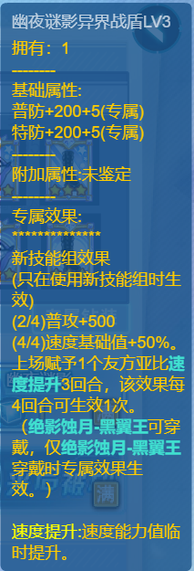

:::tip
因为魂器与晶钥的加成.**旧技能组亚比需要达到一定战力来使技能满级.**
:::

## 等级

务必拉满.

## 天赋

最好拉满,资源紧缺也要到唯我独尊后增强对应的普攻/特攻.

## 性格

增加的属性是对应的普攻/特攻即可,加速度推荐攻击并降低对位攻击的性格也满战.

## 装备

pve亚比基本上均刚需**专属装备,**除年费、秘宝外均在**装备商店**购买.

旧技能组亚比只有王者装备(简称王专);目前pve使用的大部分新技能组亚比有**王者装备**和**异界装备**.

异界是王专的下位替代,和王专提供的效果相同,但数值更低,此外可能部分效果会变成75%触发.

对比示例(上方为王专,下方为异界)

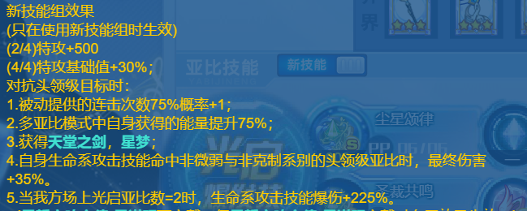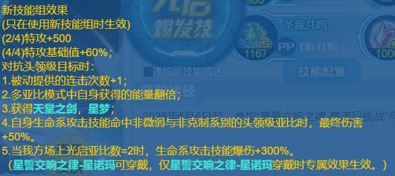
理想情况下当然希望所有亚比都带王专.然而王专每月免费获取有限.现给出王专的优先级如下.

- **T0**:**关键常用通用辅**例:女皇,子牙,女帝,阿赖,火天使,孟婆等必须上王者.女皇和子牙没异界.女帝、阿赖的王专新手送,火天使的王专达人王获得,孟婆的可以连环购获得.弱化类亚比如果只有异界,对伤害影响很大
- **T1**:**常用体系队主C**例:唤灵使,英雄奇灵王,神羲和等.体系队亚比用的很多,非常建议优先培养.唤灵使的数值很高,可以异界先凑合,但终归不如王专爽;面对最近膨胀的数值,比较老的体系会很吃力,如果要用必须上王专.
  :::tip
  **阿蒙王、英雄无冕**的王专免费送！不要没看清就去换,会血亏王钻
  :::

- **T2**:**光烬常用打手**例: 梅比乌斯,岁岁祈等.梅比和岁岁为代表的比较老的常用光烬基本上必须王专,比较新的打手如密潘、艾琳、昭君可以用异界先顶着.
  :::tip
  常用光烬中,岁岁祈和芙蕾雅的王专舰队免费兑换！1314的新手就给！
  :::

- **T3**:**体系队其他辅助、至高荣耀**例:星环师,王牌,三代猴等.星环师如果没王专会少点一颗星,王牌猴子相对特化,可以先用火天替代.至高荣耀推荐先养完常用体系再养,在各种白嫖活动中慢慢补,可代替一部分体系队.
- **T4**: 版本之子,光启神兵,群星之羽**例**:神兵洛羲,纯钧等.随缘补,不建议专门换.版本之子除了幻想史诗基本上也用不上了.部分神兵亚比的可以活动免费获得或达人王兑换,群星的王专可以域界慢慢兑换.
- **T5**: 体系队站场辅助**例**:洛羲(羲和队),狂龙(不朽龙队).就业几乎已经被群星代替了.前期群星点非常少时候给套异界凑合用,后面养都不用养.
- **特殊**:**年费渡、阿比斯、宇宙秘宝**没异界,必须王者专属,别带咸鱼套了

:::tip
百星套、樱花套等还能不能用？目前pve大部分情况用不上,体力符可以给部分需要高体力且不需要王专的亚比,如塔王、异次元晴明.

异次元装备、星辉装备等就算可以装给光启亚比也是没效果的.

异界/王专混搭是触发不了效果的,不能两件王专两件异界.
:::

## 魂卡

- **魂卡特效**
- **魂卡词条**
- **词条成长值**
- **生效魂座**
- **魂卡特效**一张魂卡的主要效果,圆就是这个魂卡的效果名,圆全名圆月,一般一张魂卡只用一个字缩写替代,下面的暴击率加成就是这个圆的具体特效.
- **魂卡词条:**词条分为普攻,特攻等,普攻是**橙色**,特攻是**蓝色,**双攻是**白色**
- **词条成长值**词条附带的数字,通过后面的+x来进行加法计算
- **生效魂座:**本魂卡词条和词条成长值达到需要的**魂座阶级**才会进行生效计算,意思是五级魂座上的魂卡**从上往下**前五条生效,三级魂座上的魂卡从上往下前三条生效,一级魂座只有第一条生效.魂座初始均为一级,需要魂砂升级.
  

- **当前成长值**
- **当前词条**
- **当前词条**:1级1/20 2级5/20 3级10/20 4级15/20 5级20/20
- **增益只与等级有关**,14/20也只算3级,同理20、21、22效果相同
- **当前成长值:**通过魂卡的**生效的魂卡成长值相加**得到
- **免费卡通过魂卡祈愿获得.回归玩家**以及**萌新**魂卡祈愿可按照此**心愿单**进行设置:
  

- **星诺玛和小星诺**分别为**吟卡、岁卡**,是输出主卡,放在五级魂座,效果为普/特攻能力值+10;威力+[20+目标体力上限/5000]1%,上限值=60%
- **赫尔墨斯、厄瑞波斯**卡分别为凑特攻/普攻、双攻的卡,放在三级魂座,分别可换为**昭烈帝/成吉思汗**,效果相同.
- **最右侧**为**识卡**,效果为:携带此魂卡的亚比**阵亡**后我方获得50%的全技能伤害加成,持续8回合,同类效果只生效一次(给最后一位自爆的亚比携带).多张识卡可刷新回合数.**资源紧缺**时,**自爆亚比**只需升级**五阶魂座**携带**识**卡
- **魂卡搭配:**
  :::tip
  **不要用系统推荐魂卡,或满战送的魂卡！不好用！！！！**
  :::

- **免费卡**的主C**PVE** 卡搭配一般为**岁/吟卡20普/特攻11双攻**,如图1:
- **图2**为**特攻**岁卡:20特攻11双攻;右图为**普攻**吟卡:**20普攻11双攻**
  :::tip
  **注:圆卡伤害略低于岁/吟卡,也要20攻11攻搭配,其他卡就不建议了.**词条为**圆**的卡有多种,请认准词条带双攻的逍遥/梵天,带爆伤的还是当副卡吧.
  :::

- **三星位置**放**特攻/普攻+双攻+特攻/普攻**的卡;**一星位置**上放**特攻/普攻**卡
  :::tip
  **氪金卡的伤害明显高于免费卡,如果有余力建议购入普攻特攻各两张.不建议直接购买,可以通过魂卡夺宝/魂卡团购等活动获得.**
  :::

- **pve目前最泛用**的**特攻**氪金卡是**尘卡**(闲看庭前花开花落-渡)
- **花卡**(春意与繁花-至臻盖亚)和**乐卡**(乐了个乐)数值更高,泛用性不如尘卡强,大部分情况下是尘卡的**下位替代**,常用于只需叠特攻数值的挂件亚比(如渡的季费、天使盟约的kk和莱特若曦等),不建议专门购买.**魂卡搭配**如下:
- **图1**为**特**攻**尘卡:20**特攻**15**双攻(三星位置特攻+双攻+特攻,一星位置双攻;或三星位置双攻+特攻+双攻,一星位置特攻) 极限伤害更高
- **图2**为**特**攻**尘卡:20**特攻**10**暴击**5**双攻(三星位置特攻+暴击+特攻,一星位置暴击;或三星位置暴击+特攻+暴击,一星位置特攻) 相对更稳定
- **图3**为**特**攻**花卡:20**爆伤**10**特攻**2**暴击(三星位置特攻+爆伤+特攻,一星位置爆伤;或三星位置爆伤+特攻+爆伤,一星位置特攻)
- 花卡词条不带特攻,难以凑20特攻.如果有流星十二宫中+3**特攻的卡,可以凑**15**特攻**16**爆伤**5暴击.
- **图4**为**特**攻**乐卡:20**特攻**7**爆伤**2**攻击(三星位置特攻+双攻+特攻,一星位置特攻)

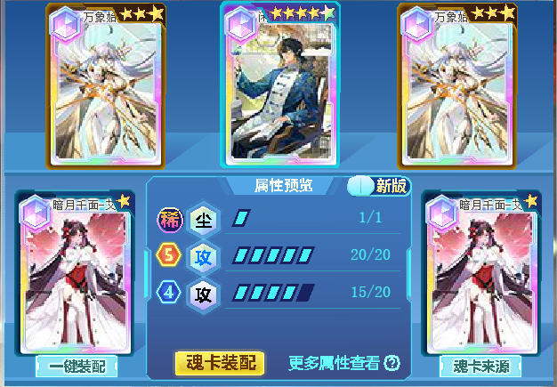

- **PVE目前**最泛用的**普攻**氪金卡为**应卡**(山海志-至臻阿卜苏)
- **诺卡**(一生之诺)大部分情况是应卡的下位替代,伤害高于免费卡,但不推荐专门购买.
- **魂卡搭配**如下(具体搭配同特攻,不再给出):
- **图1**为**普**攻**应卡:20**普攻**15**攻击**极限伤害更高**
- **图2**为**普**攻**应卡:20**普攻**15**暴击**5**攻击**相对更稳定**
- **图3**为**普**攻**诺卡:20**普攻**13**爆伤(可20普攻15爆伤,需要**十二宫卡**)
- **图4**为**普**攻**诺卡:20**普攻**7**爆伤**6**暴击

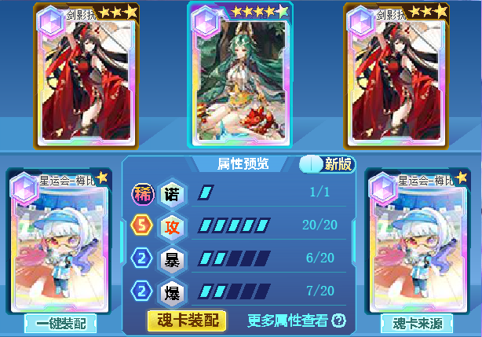

- **站场辅助**使用的免费魂卡包括**铁/佑/愈/祝**,可增强生存能力,一般搭配boss对应的防御,优先凑**20**体力(凑**15**也没关系),建议输出卡充足后祈愿.适量抽取词条为体力+任意属性+体力的卡凑词条.搭配较随意,示例如下:
- **图1**为特防**铁**卡,可提升队友**特防**(祈愿明王/曹操卡;普防祈愿巫山神女)
- **图2**为特攻**佑**卡,每回合末提高属性(祈愿沫夏卡;普攻祈愿虚空龙灵)
- **图3**为普防**愈**卡.每回合回复体力(祈愿未知之影,上位氪金卡为龙母)
- **图4**为特攻**祝**卡.提高体力上限(祈愿穷穷小恶霸;普攻祈愿星空下的誓约)
- **站场辅助**使用的氪金魂卡包括**壁卡**(妖魅睨红尘-波旬)提高队友的双防和**暴击率;秘卡**(时界秘藏-至臻奇灵王)提高队友威力.基于泛用性和获得难易,更推荐**壁卡**.同时这两张卡也可用于pvp,方便起见叠**20**速度**15**防御即可.
  ****

若希望提高站场能力可选择**龙卡**(执掌因果万世轮回-帝俊),降低前四回合受到的伤害和**源**卡(破虚空衍万龙-龙母)回合末回血.副卡搭配boss对应的防御和体力即可,也可以和pvp共用一套,叠**20**速.

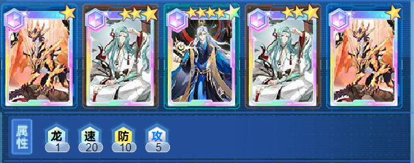
此外**环**卡可以用于多段攻击特攻亚比.**攻击次数大于等于4**时伤害高于尘卡(如法芙娜、月亮星诺、卡奥斯等).搭配为**20**特攻**10**爆伤**5**体力.

:::tip
**个人推荐优先级:尘约等于应(各有两张最佳)大于壁大于环其他**氪金魂卡不是刚需,但在星币购买项目中优先级相对较高.
:::

魂卡是可任意拆卸的,为了方便使用可以保存成预组.配置完成后点击加入预组即可.下次使用时点击魂卡方案-我的预组-使用预组即可.如果你拥有该魂卡,即使装在别的亚比身上,系统也可以自动检测并且使用,可以说非常方便了.

如果懒得配魂卡,也可以使用智能装配功能,搭配pve魂卡问题不大.

:::tip
**领取系统送的魂卡培养之前,一定要把原来装的魂卡拆掉！！！**
:::

如果希望某亚比的魂卡不会被系统自动拆下,点击左上角的小锁即可.当然**不建议点这个锁,前期魂卡比较少.**

## 魂器

:::warning
只有**新技能组**亚比可以装备魂器！！！
:::
魂器分为**技巧型**魂器和**强力型**魂器,**技巧型魂器**提供魂器特效,强力型**魂器**提供数值.

品质**史诗级**比传说级更强.

- **魂器特效**
- **特效条件**
- **魂器词条**

- **特效条件:**只有**进入战斗前**满足特效触发的数值,才会触发魂器特效
- **魂器词条:**通过**洗练**得来,提高数值.
- **魂器特效**达成特效条件后进入游戏获得魂器特效
  :::tip
  **注**:**魂之洗礼**不要乱用,不要去洗那些**没有用处的史诗级魂器**,**更不要去给魂器洗暴击爆伤穿透.PVE请认准普攻/特攻.**
  :::

在**PVE**中,我们一般给魂器洗**普攻**或者**特攻**词条.

一般**两条特攻鱼+两条普攻鱼+两本特攻书+两朵普攻花**即可满足大部分情况.新手任务就送的差不多了,慢慢洗吧.**前期千万不要洗斧头、带斧头！**

- **技巧型魂器**推荐:**永不服输的咸鱼(首选),适应性进攻模块(首选),域界兑换的流光斩(连击用)、其后的抉择和猫咪警戒玩偶(反击用)**,都是给主C用的.如图所示:
  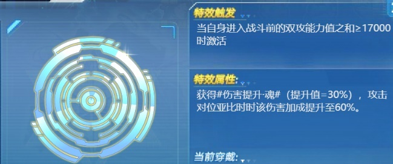**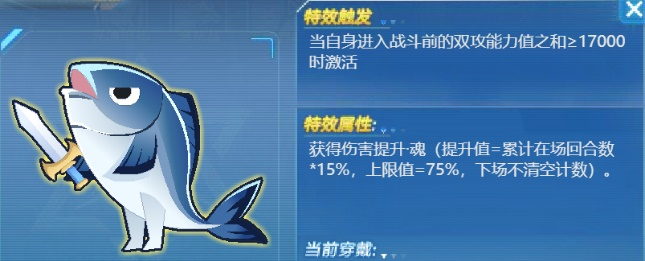**

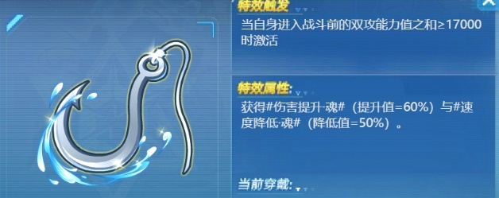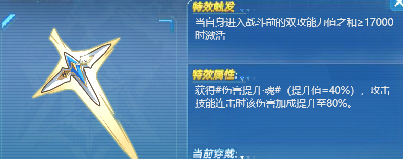

****

- **强力型魂器**推荐:**生命之泉涌**(普攻),**圣骑士异闻录**(特攻),如图所示:
- 其他**pve**可能用到的技巧型魂器:
- **风化的锁链:**可使孟婆/炽天使**自爆回合不死**,从而使**群星**阵容启动更快,特殊关卡配合愈卡可实现**第二次自爆**,延长buff回合.总之非常推荐.
- **盗火者遗契**(域界兑换):阵亡时给下个亚比**60%**威力提升**3**回合
- **魔女的永恒花园**为队友提供**24**伤害加成
- **贤者的反击**:**替换上场**受击时清除对方增益,可针对龙母/贝利亚等.
- **照世之灯**:造成**固定伤害**提高30%,目前仅供**固伤渡**使用.
- **新生的回响、树果**:回血,提高辅助的生存能力
  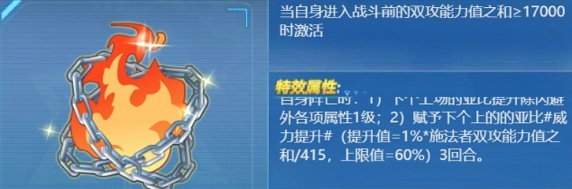

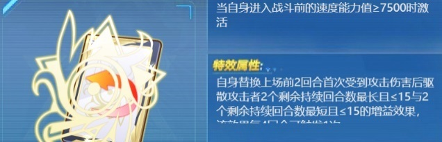

- **免死金牌**自身上场时**75**免疫一次非克制伤害,可保护辅助
- **同行者的共鸣**:队友使用**与自身属性相同**的技能时提升**30**伤害
  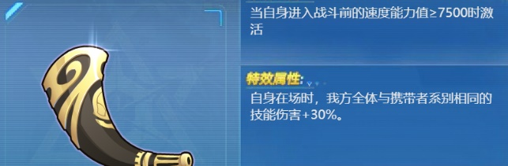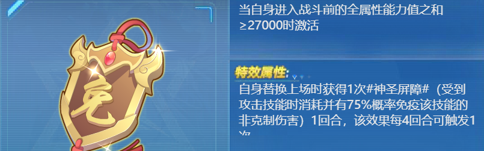

- **魂器继承系统**的使用条件:
- **1**.  只能是**传说**级魂器的词条传给**史诗**级魂器,不可以史诗级魂器之间互传,传说级魂器也是.
- **2.**  只能是**技巧型**魂器**传**给**技巧型**魂器,**强力型**魂器**传**给**强力型**魂器.
- **3**.  在**传说级**魂器**传**给**史诗级**魂器的时候,史诗级魂器**必须未洗练**
  :::tip
  洗练魂器千万千万**不要上头**,新手不要去追求八特攻/八普攻完美魂器,只需要技巧性+强力型加起来有**5-6**个需要的词条即可,上头之后一无所有.
  :::

:::warning
释放光烬也计算一次棺材已使用技能数
:::

:::tip
释放光烬也会受到**斧头**和**暗黑咒语**的只能使用一个技能**限制,一般pve不要给输出带这种东西,除非你的输出只靠大招打输出**.斧头的优先级判定非常高,英雄技、系统技等都会判定成一个技能,很不建议使用.
:::

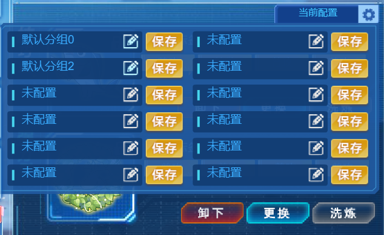

- **魂器也有预组功能**,鼠标移到右上角的当前配置处即可使用.

## 晶钥

:::warning
只有**新技能组**亚比可以装备晶钥！！！
:::

晶钥可以在**进入战斗后**提供数值加成(不显示在面板上)和伤害加成.

每个亚比可以装备两个晶钥,部分晶钥可重复.晶钥一旦装备即与该亚比绑定,不可再装备给其他亚比.两只相同亚比的晶钥是可以共用的.此外亚比及其璀璨版、星环师加冕前后(8.8更新)也可以共用.

2024年12月16日前出的亚比自带推荐晶钥.之后出的亚比则需要手动装备.然而和魂卡推荐一样,系统推荐的都不是最好的.

输出的最佳晶钥搭配:**强袭之钥(普攻+10%)/灵能之钥(特攻+10%)+共鸣之钥(与自身系别相同的技能最终伤害增加12%)**

然而晶钥的获取同样有限,**并不是所有亚比都需要极限伤害的搭配**.一般随便给两个带6%对应攻击的,对于数值较高的打手甚至可以不带晶钥.一般建议给非常常用的打手,或者实在缺伤害,再考虑装备最好的晶钥.

新技能组辅助,如女帝、孟婆、火天使、群星等可以装备**力量之钥(全背包亚比普攻+3%)/智慧之钥(全背包亚比特攻+3%),效果多多益善,作为锦上添花**这种晶钥没必要浪费自选晶钥来选,随机晶钥随缘开出来即可.
