# 亚比介绍

本章介绍亚比的技能及作用.

## 基本机制补充

### 技能优先度

- **光启面对非光启**拥有99%真抗,获得boss化能力,不等于boss.非光启亚比pvp生效的斩杀/重置对光启亚比不生效;星辉面对非星辉非光启,拥有95%真抗,视为boss.非星辉非光启亚比pvp生效的斩杀/重置对星辉亚比不生效

- **技能先发度：光启爆发技**>超星辉必杀>异次元必杀>传奇必杀>超奥义>**光启小技能**>星辉小技能>异次元小技能>传奇小技能>究极变身 注意**光启不同系统先发度不同.例如光烬的先发度等于光启小技能.**
- 注意部分技能会标注先**发度等于光启爆发技,如至高祝福.**
- 超快先发度+1>超快>普通
- (1) 必杀优先级
- 光启爆发技先发度+1>光启爆发技>超星辉必杀超快速度>超星辉必杀>异次元必杀超快速度>异次元必杀>传奇必杀
- (2) 小技能优先级
- **光启先发光能技能>光启光能技能>光启先发pp技能>光启pp技能**>星辉三星先发>星辉三星>星辉技能>异次元先发技能>异次元普通>后发
- (3)**切亚比先发度**
- **光启爆发>星辉爆发>切亚比>嗑药>小技能**
- 光启/星辉/异次元/传奇/奥义**正常大招优先级跨时代大于普通小技能 比如：星辉大招/异次元大招/超奥义快于光启小技能.**

### 伤害抗性：真抗与假抗

- **真抗：减少一切伤害.**红色直伤(技能直接伤害),紫色固伤(扣除、吸取、百分比),因此可以**减少黄色总伤害.亚比中只有[色欲之罪]凯撒可以削弱.**
- **假抗：只能减少红色直伤.曰削弱的抗性是假抗.**
  :::tip
  技能单段红色直伤伤害上限999999(四舍五入为100 w)
  真抗的增减可以影响伤害上限.
  系统关卡给的#抗性提升#一般都是假抗;受到伤害降低是真抗.
  :::

### 攻击次数与连击数的区别

- **技能攻击多次(简称多段)和连击的是不一样的**
- **多段：一个技能一次能打出≥2个红色直伤**的就是多段技能.
- 技能描述为**攻击目标x次/攻击次数+x.**
- **连击：释放一个技能**后,**自动再次释放技能**的就是连击,技能描述为**连击.**

主要区别在于**多段只行动了一次;而连击行动多次**,因此攻击目标阵亡后,如果还有剩余的连击次数会追击其他目标/替换目标;多段不会.

- **攻击次数的buff和连击的buff**是不一样的,因此有必要区分这两个概念.
- **例：妖王冽的万妖百斩攻击次数+[1, 99] 多段**
- **光烬岁岁祈的连击一次该技能 连击**
- **卡奥斯体系队 攻击次数＞5 多段**
- **圣天伊体系队 连击技能 连击**

## 通用辅助

(均为王者专属效果,数值均为上限数值,**带★的为常用辅助)**

- **辅助f4：**指**女皇、子牙、龙王、黑翼**,6v1通用辅助,其中女皇和子牙最重要,龙王其次,三者均可以首充获得,也可以星币获得.黑翼重要性相对低.

- **辅助f4：**指**女皇、子牙、龙王、黑翼**,6v1通用辅助,其中女皇和子牙最重要,龙王其次,三者均可以首充获得,也可以星币获得.黑翼重要性相对低.
- **1. 永霜寒玉-冰雪女皇★：自爆,削属、锁属、提属、暴击爆伤提升、保护属性**
  上场获得**5**光能,**扣除对方全场2光能**;大招牺牲自己**对单体无视保护**削弱**全属性6级**、**属性等级无法提升15回合**、**无视保护削弱15%数值**,我方**属性等级提升至最高,暴击率+100%,爆伤+200%,可继承,15回合.**下个出场亚比**受到直接伤害-99%,2回合**.1光技能**保护属性等级及能力值**,**可继承**,**15回合**.

- **注**很通用,6v1和4v2都必备,遇到削属性能力强的开护属.**不需要璀璨版！**

- **2. 代天封神-姜子牙★：自爆,能力值削弱、能力值提升、锁血**
  上场**满**光能,免疫所有技能**1**回合,赋予**敌方全场能力值降低当前值的50%,20回合;**大招牺牲自己,赋予**单体无法回复体力20回合;**首次离场(阵亡/切换均可)我方**全属性能力提升上场值的70%,单项上限15000,体力及上限提升上场值的50%,体力上限最多50000,可继承,20回合.**1光技能前两次使用**扣除敌方2光能**.

- **注：**常用于6v1,4v2有时候也可以用来站场.由于大部分光启boss回血较少,不一定要自爆.注意数值削弱当前值,部分boss可能有**星梦**,上场后提升能力值,只靠子牙无法削弱至最低,可以携带其他弱化亚比如女帝、火天使等.

- **3. 四海滔天-敖兴★：自爆,减伤、削属、概率化解、光能返还**
  上场获得**6**光能且**抗性提升80% 1回合**;大招牺牲自己,赋予单体**提升的属性等级回合末翻倍降低12**回合,我方亚比**受到直接伤害-60%**,**60%免疫攻击技能,回合末25%返还本回合消耗的光能,伤害提升150%,可继承,12回合**.

- **注**一般只在6v1使用,可以大大增加生存能力,返还光能也非常重要.

- **4. 绝影蚀月-黑翼王★：自爆,增伤、回血**
- 上场满光能**且提升自身体力及上限75%,全属性60%**;大招牺牲自己,赋予我方**伤害提升200%,每回合首次使用技能回复15000体力,可继承,20回合**.
- 6v1用,大部分打手每回合自带体力回复均为15000,面对伤害较高boss时可以变提高生存能力.伤害加成较少,可以换为别的辅助.

- **星诺f4：太阳、圣灵、龙和木四只星诺**功能相当于女皇、子牙、龙王和黑翼,但如果打手不是星诺家族亚比时,提供的增益只有75%效果,当打手数值较高或boss数值较低时也是完全够用.需要四只一起使用,否则加成会少.
- **5. 日曜奇迹-太阳星诺★：自爆,削属、锁属、提属、暴击爆伤提升、保护属性**
  上场获得**5**光能;大招牺牲自己**对单体无视保护**削弱**全属性6级**、**属性等级无法提升12/8回合**,我方**属性等级+6/4,暴击率+100%/75%,爆伤+200%/150%,可继承,15回合.**下个出场亚比**受到直接伤害-99%/75%,2回合.**小技能**100%/75%保护属性等级及能力值**,**可继承**,**15回合**.

- **注**由于太阳星诺可以带魂器,可以带锁链先用小技能保护属性.

- **7. 星光奇迹-圣灵星诺★：自爆,能力值削弱、能力值提升、锁血**
  上场**满**光能,赋予**敌方全场能力值降低当前值的50%,20回合;**大招牺牲自己,赋予**单体无法回复体力20回合;**首次离场(阵亡/切换均可)我方**全属性能力提升上场值的70%/52.5%,单项上限15000/11250,体力及上限提升上场值的50%/37.5%,体力上限最多50000/37500,可继承,20回合.**

- **8. 超界奇迹-龙星诺★：自爆,减伤、概率化解、光能返还**
  上场获得**5**光能且**抗性提升80% 1回合**;大招牺牲自己,我方亚比**受到直接伤害-60%/45%**,**60%/30%免疫攻击技能,回合末25%/18.75%返还本回合消耗的光能,伤害提升150%/112.5%,可继承,12回合**.

- **9. 天地与我竞争自由-逍遥：自爆、化解、能力禁锢、额外光能**
- **使用新技能组.**上场获得**4**光能;大招牺牲自己,赋予**敌方能力值无法提升5/7回合**;离场(阵亡/切换均可)赋予**下个出场亚比150%化解(2+敌方数/2,向下取整)次攻击技能3回合,冷却4回合,每回合未受伤害额外获得1光5回合.**
- **注**boss如果有精准buff,可能会无视我方化解,而逍遥提供的150%化解率一般不会被无视.用的较少,面对伤害很高的特殊亚比或配合固伤潘多拉使用.

- **10. 幻海奇迹-水星诺：自爆、化解、能力禁锢、额外光能**
  上场获得**4**光能;大招牺牲自己,赋予**敌方能力值无法提升5/7回合**;退场后(阵亡/切换均可)赋予**下个出场亚比100%/75%化解(2+敌方数/2,向下取整)次攻击技能5回合,每回合未受伤害100%/60%额外获得1光5回合.**

- **注**面对伤害很高的特殊亚比可以替换掉木星诺/龙星诺.

- **11. 群星之羽★**：**非自爆,相同系别我方亚比克制倍率、特攻/普攻数值加成**
- **使用时点击群星祝福后切换即可**,**详见3.2.**
- **注**6v1几乎必备,4v2也非好用,缺点是需要积累.

- **12. 版本之子：自爆,对指定系别boss伤害加成**
- 版本之子没有专门的系统,特征是大招自爆获得XX·攻,提供对**三个指定系别的boss增伤(绝大部分初始150%,异界225%,王专300%)**,**可继承,10回合**
- 根据boss属性选择版本之子速查如下：
- (1) 【缘分一线牵-小狐仙】永恒、生命、不朽
- (2) 【乐园守护者-星光角斗士】神兵、格斗、飞行
- (3) 【冰封之心-伊莎女王】仙灵、黯星、虚境
- (4) 【孤注一掷-骰子大王】数码、超土、超电
- (5) 【午夜大冒险-黑夜童心】神兵、格斗、飞行
- (6) 【寒冰之拳-冰拳艾司】上古、圣灵、超王**王专增伤350%,异界300%**
- (7) 【大妖血脉-妖王冽】神秘、时空、超神**由于技能段数多,偶尔有用.**
- (8) 【倾世之寒-始祖冰龙】超龙、超光、超暗**可免费获得王专**
- (9) 【沙漠之心-阿努比斯】上古、超王、圣灵**可免费获得王专**
- (10) 【卷帘大将-沙悟净】湮灭、乾坤、完全**可免费获得王专**
- (11) 【天蓬元帅-猪八戒】超水、超火、超木**可免费获得王专**
- **获得方式：版本福利→签到礼→自选版本之子**
- **推荐**优先获得可白嫖专属的.其次骰子大王是神兵,契约亚比释放必杀即可增伤,可以给女皇绑定.因为自爆版本之子亚比已包含所有系别,此后出的版本之子亚比都是月副本(入口：挑战试炼→时光副本)可以白嫖的超维亚比.
- **注**异界和王专均可以上场自爆,一般在黑翼前自爆,否则黑翼的回血会让版本之子免死.版本之子由于伤害加成会被稀释,效果远远不如群星,一般挑战使用较少,实在缺伤害或者幻想史诗等封亚比的6v1才使用.

- **13**.**凝尘造界之星神-星尘**：**自爆,锁属、额外光能、威力提升**
- 上场获得**6**光能;大招牺牲自己,**下个出场**的亚比**每回合额外获得4光5回合**,**技能威力提升消耗光能数\*50%,最高200%**,**10**回合.
- pve一般配合**主要依靠大招输出**的亚比使用,也可以配合**光烬亚比**使用.

- **14**.**赤月刀姬-曰**：**非自爆,抗性削减、扣光**
- **每次攻击为目标**添加**1**层**赤月印记20回合**,**每层减少10%抗性,上限5层,最多削减至0%,抗性为0%时受伤增加100%**.2光赋予目标**光能流逝(每回合末扣除1光能,持续X回合,X为赤月印记层数**).离场时对敌方全场**自动使用一次2光技能**.快速叠印记可以使用**秘术飞剑(攻击体力比例比自身高的亚比可连击一次),大招必定攻击两次**.
- **注**很少用,只在boss自带伤害抗性时有用,可配合缔结师奥丁,但很少用.

- **15. 甜蜜信使-愚者：自爆,单段伤害提升**
- 上场获得**5**光能;大招牺牲自己,使敌方**每回合受到**的**最高单段伤害附带60%固伤,**上限**60w,8回合.**
- **注**早期辅助,很少用,少有的就业是配合一代夜樱/潘多拉使用.

- **16. 尘世繁华-阿赖耶识：非自爆,回春、光能定格、威力提升**
  上场**满**光能;大招**使威力提升30%\*消耗光能数**,**上限180%**,**可继承,10回合;**离场赋予**下个亚比1次回春(受到致命伤害时回复25%最大体力,上限20000)和双防提升上场值20%各15回合,锁定光能3回合.2光逼退自身.**

- **注**早期辅助,想配合大招型打手还需要提前上场攒光,**基本已被星尘替代**.

- **17. 时音弥漫·洛羲：自爆,伤害提升(星辉亚比)**
- 上场**5**星,大招牺牲自己,使**我方亚比每回合伤害+20%,上限200%,可继承,无限回合**
- **注**早期辅助,由于结算问题和需要发育,是黑翼王的下位替代.

- **18. 梦幻绮丽之夜-羲和：非自爆,吸血,爆伤(星辉亚比)**
- 上场给敌方添加梦幻印记,攻击带印记目标**吸血+100%**,**爆伤+50%**,**无限回合**
- **注**早期辅助,适合高伤害目标保证续航,也可以配合渡使用.

- **以下辅助效果与我方在场亚比数有关,=2时最大(红色数字),=1时蓝色数字**
- **19. 寰宇皆臣-女帝★：自爆,削属弱化、特攻亚比伤害提升**
- 上场**满**光能;大招牺牲自己,**削弱敌方全场6级全属性,弱化(全属性能力值降低50%/25%)10回合;我方获得特攻技能伤害提升200%/100%,可继承,10回合;下个亚比立刻获得4光能.**
- **注：**4v2**特攻**亚比**通用**辅助,而且免费王专.上场会**扣除自己20%体力**,因此**无法触发锁链魂器**.黑翼王祝福/**源卡(龙母卡)**可以使其自爆后不死.

- **20. 幽泉使者-孟婆★：自爆,削属、弱化、特攻亚比爆伤提升**
  上场**满**光能,**扣除对位3光能**;大招牺牲自己,**削弱敌方全场6级全属性,弱化(全属性能力值降低50%/25%)10回合;我方获得特攻技能爆伤提升200%/100%,可继承,10回合;下个亚比立刻获得4光能.**

- **注：**4v2**特攻**亚比**通用**辅助.孟婆和女帝哪个伤害高,取决于你的输出有没有自带爆伤.如果输出自带很多爆伤,就用女帝,反之孟婆.
- **双弱化打法**：可以通过**魂器携带锁链**实现**自爆**不死.由于锁链锁血1回合,配合愈卡回合末回血,可以第二回合替换下场,等到弱化和爆伤加成结束后替换站场辅助上场,通过凹对方不攻击孟婆,实现**再次自爆**,相当于**延长了buff的回合数**,需要运气但可以有效增加伤害,配置实在不够时可以考虑这个打法.

- **21. 圣火炽天使-塞勒芙★：自爆,弱化、普攻亚比爆伤提升**
- 上场**满**光能;大招牺牲自己,**削弱敌方全场6级全属性,弱化(全属性能力值降低50%/25%)10回合;我方获得普攻技能爆伤提升200%/100%,可继承,10回合;下个亚比立刻获得4光能.**
- **注：**4v2**普攻**亚比**通用**辅助,达人王免费获得本体及王专.召唤阵和神宠秘境也能获得本体.

- **22. 无名无始之境-阿赖耶识★：非自爆,提属、特攻亚比暴击提升、威力提升**
- **大招释放后立即返回背包**,赋予队友**受到攻击使用专属技能反击一次**,**特攻技能暴击率提升100%/50%,威力提升150%/75%**,**可继承,10回合;首次离场**赋予**我方全体6级全属性等级(仅包括目前在场亚比和替换亚比,不可继承)**.
- **注：**4v2**特攻**亚比**通用**辅助,而且免费王专.同样是提升暴击率和属性等级,但一般**效果并不如冰雪女皇**,除非是梵天队这样的**双特攻c**队伍,但梵天队也有上位替代.还有一个优势是可以**提升站场辅助等级**,增加生存能力.此外,可以在6v1中被阿比斯拉出来作为站场亚比,大招可以套反击增加输出.

- **23. 月影映夜澜-夜樱★：非自爆,提属、普攻亚比暴击提升、威力提升**
- **大招释放后立即返回背包**,**驱散对方2个最新获得且回合数＜10的增益效果**,赋予队友**普攻技能暴击率提升100%/50%,威力提升150%/75%**,**可继承,10回合;首次离场**赋予**我方全体6级全属性等级(仅包括目前在场亚比和替换亚比,不可继承)**.小技能可以赋予目标**2**次**受伤提高40%**,**3**回合.
- **注：**4v2**普攻**亚比**通用**辅助,一般**效果并不如冰雪女皇**,用的也相对较少,一般用于站场辅助非常容易被直接伤害打死的普攻队伍或普攻双c队伍.

## 群星之羽(辅助)

群星之羽亚比简称**群星**,是非常重要的辅助,6v1和4v2都很常用.

带有此系统图标的亚比即为群星之羽亚比,有时也称为**流星之子**.

- **群星作用：**对抗**群星系别克制的**敌人时,使用群星辅助**同系别**打手可以获得强大的**克制倍率和数值加成**,增伤效果非常明显.
- **群星点数：点击系统中的获得星光,**每个群星亚比**本体**和**装备王者专属各**算一个星光数(异界不能).每个星光数需要消耗**100系统强化石**获取.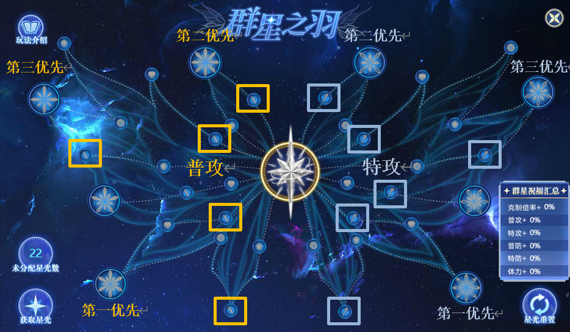
- **群星点分配**：点击图标即可点亮.左半边为**普攻**区域,右半边为**特攻**区域.切记**克制倍率优先级最高**.优先点第一优先的**大星**,点数不够时优先点小的**特攻/普攻**点.图中没有体现,群星配置目前已经可以**存成预设**,建议普攻特攻各一套.
- **群星使用**：群星首发时无等级限制,非首发时需满级,**点击群星之羽**图标即可获得群星祝福.群星技能释放的**先发度**取决于本回合操作,一般吃药/切亚比.
- **群星祝福：10/15**回合,获得群星之羽系所有加成,**可继承**给**下一个**同系别亚比.
- **注：**群星使用后切换的亚**跟群星系别不同**,再切换成同系别的亚比,群星祝福仍可以继承(例:圣灵→王→圣灵依然可以继承祝福)且中途不计算回合数.
- 如果切换到**同系别**的亚比吃到群星祝福之后,**再次切换**会使群星祝福消失.
- (例:龙吟守→龙王→1314,1314是吃不到群星祝福的)
- 群星祝福只给**自己以及自己切换**到的亚比,不是全场,4v2尤其注意.阿比斯拉群星站场前不要忘记开群星祝福;
- 租借过来的群星点数使用的是**自己的**群星点数.亚比**获得群星祝福**后,切换属性(如渡、星龙变身,密潘切换神格)仍可继续使用祝福.
- **速查表(1-16可以召唤阵换取本体,1-19可以域界兑换本体及王专,21可以当期通行证免费获得本体,30奥币获得王专.此外部分活动也可能增送)：**
- (1) 【驱灵神捕-琳琅】超神系群星★
- (2) 【1号机-图灵】超数码系群星★
- (3) 【余烬初王-洛兰】超王系群星★
- (4) 【冰龙之子-冰罗皇】超水系群星
- (5) 【翼龙之子-凌风】超电系群星★
- (6) 【翼龙之子-银风】超飞行系群星
- (7) 【影龙之子-帝卡】超光系群星★
- (8) 【巨龙之子-明王】超土系群星★
- (9) 【龙魂之矢-龙吟守】超龙系群星★
- (10) 【冰凝之魂-雪无寒灵-】超圣灵系群星★
- (11) 【幽星荒主-天元夜神】超木系群星
- (12) 【漫游星境-小熊座】超神秘系群星★
- (13) 【涅槃至尊-雀皇紫辰】超暗系群星★
- (14) 【巡航迅影-利飞】超火系群星
- (15) 【寒霜利刃-烈魄】超神兵系群星
- (16) 【重击雷霆-铁拳袋鼠】超格斗系群星
- (17) 【时渊裂缝-时间之神】超时空系群星★
- (18) 【红莲尽染-御星璃】超上古系群星
- (19) 【圣咏御天使-银】超乾坤系群星★
- (20) 【黑渊黯翼-混沌巨龙】黯星系群星
- (21) 【玉魂巫女-花萤姬】生命系群星
- **注**：异界和王专可以额外提升**25**克制倍率.其他效果均为增伤(群星也可以作为数值较低的打手),没有也不影响使用.但是站场需要培养提高肉度.

## 神兵亚比(局外辅助)

- **光启神兵**亚比简称神兵,在系统中绑定后,无需出战即可使亚比获得一定加成.
- 带有此系统图标的亚比即为**光启神兵**亚比,且属性为xx系+超神兵系
  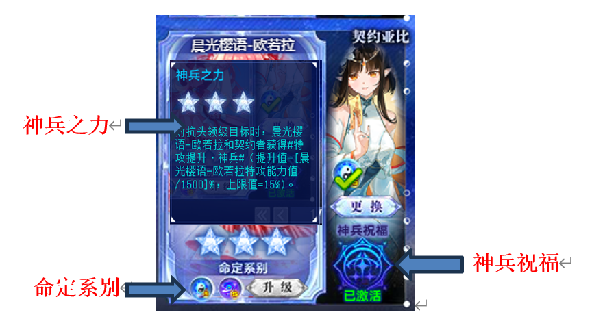

- **神兵契约后,**可为**所有亚比**提供**神兵之力**,只为**命定系别**亚比提供**神兵祝福**.
- **神兵之力：**只要契约即可获得神兵对应的**能力值加成,随神兵系统等级提高**.
- **注**：实际上能力值加成**无上限**,且不是按照神兵亚比本身的数值提升,是按照**绑定亚比数值**的百分比提升(系统满级后为\*\*[绑定亚比能力值/1500]%).
- 这意味着**加成跟神兵本体没有关系**！神兵**不用养成**,需要第二系别给异界即可,除非钱多或者能白嫖,最后再考虑给常用神兵王者.
- **命定系别：**一个神兵**一般**有**两个命定系别**,分别是神兵亚比本身的系别+一个额外命定系别.异界和王者均可开启第二命定系别.
- **神兵祝福：**只有契约的亚比系别跟神兵的两个**命定系别**一样时,才可以激活神兵祝福.神兵祝福随着神兵系统等级提高而提高,**王者专属**才能**额外提升**.
- 每个神兵需要**200系统强化石**才能将系统升满.
- 神兵祝福无特殊情况都是**持续20回合**,**首次上场生效**,**替换消失**.一旦获得神兵祝福后,切换形态等使属性发生改变,不会使神兵祝福消失.
- **常见神兵祝福类型**(数值均为**总伤害提升值**)：
- **伤害提升·神兵 提供伤害加成**
- **神兵之力**加成是**10**的：
- 初始伤害提升**5%**;**系统满级**伤害提升**35%**;**装备王专**伤害提升**60%**.
- **神兵之力**加成是**15**的
- 初始伤害提升**30%**;**系统满级**伤害提升**60%**;**装备王专**伤害提升**100%**.
- **2. 爆伤提升·神兵\*\***提供爆伤加成**目前只有**洛羲和圣天伊
- **神兵之力**加成均为**15%**
- 初始爆伤提升**10%**;**系统满级**爆伤提升**60%**;**装备王专**爆伤提升**120%**.
- **注：**神兵和绑定亚比需**相同技能组**〈使用**新技能组神兵**绑定**旧技能组亚比**,旧技能组亚比依旧**可以**吃到祝福,但是使用**旧技能组**绑定**新技能组**亚比**吃不到加成**〉
- **旧神兵**绑**旧技能组亚比**提升的数值会显示在**局外面板**上,故**pvp,pve都生效**;**新技能组**神兵提升的数值**不显示**在背包亚比面板上,战斗内显示,只在对抗头领 (pve) 时生效, PVP中神兵只有攻击特效和buff显示,但实际上并没有加成.
- **6v1推荐数值神兵**(特攻/普攻与打手一致,优先吃到**神兵之力**加成),**4v2**则能吃到**神兵祝福**更佳,当然两个都能吃到更好.
- **一只神兵亚比只能契约一个亚比.**点击系统界面的**所有神兵**,可以**快捷更换**所有神兵绑定的亚比,同时可以查看所有神兵亚比(包括未获得)的命定属性.
- **速查表(亚比名-命定系别/第二命定系别-神兵之力-神兵祝福,满级系统)：**
- (1) 【戮器仁心-帝刃】超上古系/超王系 普攻提升**10%**伤害提升**35%/60%**
- **注**可白嫖满战.**有旧技能组和新技能组**.
- (2) 【神兵护佑-圣盾】超上古系 特防提升 与人作战时获得护盾
- **注：**可白嫖满战.但**只有旧技能组**,pve用处很少,pvp如今也几乎没用了.
- (3) 【幽冥千练-鬼墨无忧】完全系/超火系 特攻提升**10%**伤害提升**35%/60%**
- **注：有旧技能组和新技能组**.
- (4) 【逐梦追光-布灵灵】超王系 特攻提升 与人作战时提升双防、暴击1级.
- **注：只有旧技能组,给英雄无冕绑定毫无用处**可以给启元麒麟,多排/狂野.
- (5) 【王者加冕-圣天伊】超光系/湮灭系 普攻提升**15%**爆伤提升**60%/120%**
- **注**可白嫖本体和王专.**有旧技能组和新技能组**.
- (6) 【鸣劫制裁-雷霆青龙】超电系/超水系 特攻提升**10%**伤害提升**35%/60%**
- **注**可白嫖满战.**有旧技能组和新技能组**.
- (7) 【荒炎焚天-飓焰朱雀】超火系/超格斗系 普攻提升**10%**伤害提升**35%/60%**
- **注**可白嫖满战.**有旧技能组和新技能组**.
- (8) 【孤注一掷-骰子大王】超数码系/超水系 普攻提升**10%**
- **特殊神兵祝福：首次使用光启爆发技时获得,对抗超数码/超土/超电系boss时伤害提升80%/100%,可继承,10回合**
- **注：**可以签到奖励兑换本体.**有旧技能组和新技能组**.由于**超水**作为第二属性和**大招触发**,常见用法是带异界/王专并契约冰雪女皇.也可以契约超数码普攻打手.另外骰子大王是版本之子,大招自爆的buff和神兵祝福是**同名buff**,因此后触发的buff会替换掉之前的buff,使用时要注意.
- (9) 【时序之光-洛羲】超神系/超暗系 特攻提升**15%**爆伤提升**60%/120%**
- **注**达人王可白嫖本体和王专.**有旧技能组和新技能组**.
- (10) 【逐罪之剑-辉刃艾恩】超王系/超木系 普攻提升**10%**伤害提升**35%/60%**
- **注：有旧技能组和新技能组**.
- (11) 【神威重壁-惊涛玄武】 超土系/超飞行系 普防提升**10%**抗性提升**20%/30%**
- **注**可白嫖满战.**有旧技能组和新技能组**.并不是增伤而是增加生存能力.
- (12) 【妙笔创生绘世-女娲】 仙灵系/超龙系**精准10%/20%**
- 伤害提升**60%/100%**
- **注：有旧技能组和新技能组**.精准意思是无视化解的概率.最终化解概率等于化解率-精准值.在对技能有化解的boss时可能有些用处.
- (13) 【夜与月的蔷薇-夜兰】 超木系/超时空系**天之箭10%/20%**
- 伤害提升**60%/100%**
- **注：有旧技能组和新技能组**.天之箭意思是无视免疫技能特效的概率,与精准类似.常见的技能带有免疫技能特效的boss包括启元龙母和带专属的三代梦.
- **之后的神兵亚比均只有新技能组**
- (14) 【炎刃燎原-赤霄】 超圣灵系/超电系 普攻提升**15%**伤害提升**60%/100%**
- (15) 【剑逐山河-轩辕夏禹】 超时空系/神兵系 普攻提升**15%**伤害提升**60%/100%**
- **注**达人王可白嫖本体和王专.挑战有一关敌方体力越低伤害越高易翻车
- (16) 【晨光樱语-欧若拉】 乾坤系/超神秘系 特攻提升**15%**伤害提升**60%/100%**
- **注**达人王可白嫖本体和王专.
- (17) 【极寒怒涛-噬星白虎】 超水系/超神兵系 特攻提升**10%**伤害提升**35%/60%**
- **注**可白嫖满战.达人王可白嫖本体和王专.
- (18) 【苍松剑意-干将】 黯星系/超水系 特攻提升**15%**伤害提升**60%/100%**
- **注**达人王可白嫖本体和王专.
- (19) 【明月剑心-莫邪】 超时空系/生命系 特攻提升**15%**伤害提升**60%/100%**
- **注**可白嫖满战.达人王可白嫖本体和王专.
- (20) 【千里踏燕-鱼肠】 虚境系/超木系 特攻提升**15%**伤害提升**60%/100%**
- **注**可白嫖满战.达人王可白嫖本体和王专.
- (21) 【剑影迷踪-承影】 完全系/超电系 特攻提升**15%**伤害提升**60%/100%**
- **注**达人王可白嫖本体和王专.
- (22) 【天人共铸-纯均】 超神系/超土系 普攻提升**15%**伤害提升**60%/100%**
- **注**达人王可白嫖本体和王专.
- (23) 【天罪断炎-暗行罗刹】 超暗系/仙灵系 普攻提升**15%**伤害提升**60%/100%**
- **注**可白嫖满战.达人王可白嫖本体和王专.
- (24) 【剑指天下-太阿】 湮灭系/超数码系 特攻提升**15%**伤害提升**60%/100%**
- (25) 【飞剑游云-湛卢】 超暗系/不朽系 特攻提升**15%**伤害提升**60%/100%**
- (26) 【玄潭游龙-七星龙渊】 超龙系/超水系 普攻提升**15%**伤害提升**60%/100%**
- (27) 【东方秘毒-鹤顶红】 永恒系/不朽系 特攻提升**15%**伤害提升**60%/100**
- (28) 【东方秘毒-情花毒】 超飞行系/超土系 特攻提升**15%**伤害提升**60%/100**
- **注**挑战因为很高的恐惧率而臭名昭著,建议用一个数值怪享受恐惧或等白送.
- (29) 【东方秘毒-夹竹桃】 超上古系/超光系 特攻提升**15%**伤害提升**60%/100**
- (30) 【东方秘毒-绝情丹】 超木系/永恒系 普攻提升**15%**伤害提升**60%/100**

- **注：**粗略估计,绑定神兵可以**增加至少10%的伤害**,建议神兵绑定该系别最常用的打手,缺伤害的时候也应检查是否绑定了合适神兵.懒得更换可以多弄几只.
- 神兵亚比均**带有超神兵系**,作为boss时可能对系别克制有影响,但一般无需在意.另一方面可以吃到超神兵系群星,白送王专的可以作为数值较低的打手.

## 光烬亚比(打手)

从本节开始,正式进入打手亚比的介绍.判断一个亚比是否能作为pve打手非常简单：看技能中是否带有**对抗头领级目标的效果**即可.作为打手的能力到底如何,要从威力、攻击次数、伤害、爆伤加无视防御等各项加成数值来具体判断.

###什么是光烬亚比

带有此系统图标的亚比即为**光启光烬**亚比,简称**光烬**.

光烬亚比是游戏内最常用的一类打手,特点为**4**次**单回合高爆发**,在6v1和4v2两种模式中均有着较高的出场率.

- **光烬特技：**使用**不占用回合**,先发度与普通技能一致,使用后**直到本回合末**都会**强化特定技能**;每次使用均会损失**1**光能上限;初始使用次数为2,消耗**200**系统强化石升满后可使用**4**次.
  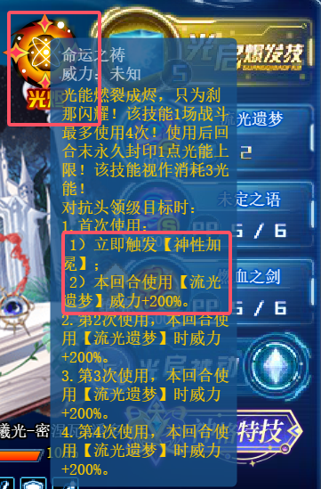**局内使用：**如图.**点击光烬图标**后即可强化指定技能(即专属技能,一般是消耗**2**光能的技能,简称二光)打出高爆发.**首次使用**还会触发**光启爆发技**的特殊效果,包括但不限于保护属性、死亡抗拒·伪等,一般为增伤或增加生存能力的效果.

- **注意事项：光烬特技**一局战斗中只能使用**4**次,因此使用的时机很重要.大部分光烬亚比的**被动包括随在场回合数获得强化的效果**,一般需发育到**在场第3回合**.而且**魂器咸鱼**也会使伤害随在场回合数提高而提高,一般推荐在**识卡buff剩余回合数=4**的那回合开始使用光烬.
- 光烬特技带来单回合高爆发,但**不代表使用完后就失出输出能力**,4次用完后没打死boss也可以再用几回合二光试试.
- 使用光烬特技也算使用技能,因此魂器不要带斧头/暗黑咒语/棺材.
- **域界降临**中光烬亚比可以**无限次**使用光烬特技.

### 光烬亚比自带增伤统计

<仅统计暴击率,威力,爆伤,能力值,伤害,穿防.部分特殊增伤也会指出>

<仅列出上限数值和出处.均为**新技能组效果**>

- **光烬：**系统特技**二光**：光烬对应技能**被动：**亚比被动**装备：**王者专属
- **=2**场上亚比数为2,单独标注 括号内为增益来源
- **(1) 逐愿淬光之明-阿格蕾亚 超神秘系**普攻
- **二光威力和攻击次数**600 × 4(王专)
- **暴击：**40%(装备)**威力：**400%(光烬+装备)+130%(=2)**爆伤：**无
- **能力值：**无**伤害：**210%(被动)+130%(=2)
- **穿防：**66%(二光+装备)
- **(2) 万象始源之刻-赫尔墨斯 超飞行系 特攻**
- **二光威力和攻击次数：**400 × 3
- **暴击：**40%(被动)**威力：**550%(光烬+装备+被动)+200%(=2)
- **爆伤：**100%(被动)**能力值：**50%(被动)**伤害：**250%(被动)+200%(=2)
- **穿防：**33%(二光+装备) 首次使用大招获得额外20%**克制倍率 5回合**
- **(3) 极乐欲界天魔王-波旬 超神兵系 普攻**
- **二光威力和攻击次数：**300 × 4
- **暴击：**40%(被动)**威力：**400%(光烬+装备+被动)+165%(=2)
- **爆伤：**240%(装备)**能力值：**无**伤害：**150%(被动)+165%(=2)
- **穿防：**75%(二光+装备)
- **(4) 无言的祈愿-海蒂拉玛\*\***超数码系 普攻\*\*
- **二光威力和攻击次数：**600 × 2
- **暴击：**40%(二光)**威力：**200%(光烬)+125%(=2)
- **爆伤：**无**能力值：**200%(二光)**伤害：**100%(装备)+25%(=2)
- **穿防：**75%(被动)
- **(5) 荒秽堕墟-阿波菲斯 超土系 特攻**
- **二光威力和攻击次数：**600 × 2/3/4/5/6 每使用一次光烬增加一次(装备)
- **暴击：**40%(被动)**威力：**250%(二光)
- **爆伤：**无**能力值：**无**伤害：**200%(=2)
- **穿防：**80%(光烬+装备)
- **(6) 葬魂曲-死神弥尔 生命系 特攻**
- **二光威力和攻击次数：**1700(随机连击1-3次)
- **暴击：**40%(装备)**威力：**450%(装备+光烬)**爆伤：**无
- **能力值：**无**伤害：**无**穿防：**50%(装备)
- **(7) 逆律之触-伊西斯 永恒系 普攻**
- **二光威力和攻击次数：**600 × 1-3 体力比例低于目标时必定3次
- **暴击：**40%(被动)**威力：**500%(装备+光烬)
- **爆伤：**120%(装备)**能力值：**无**伤害：**180%(装备)
- **穿防：**75%(装备)
- **(8) 如星永伴长夜-梦\*\***黯星系 特攻\*\*
- **二光威力和攻击次数：**700 × 2(连击1次) 攻击全场
- **暴击：**40%(被动)**威力：**340%(装备+光烬)**爆伤：**无
- **能力值：**112%(被动)**伤害：**77%(被动)+158%(二光)
- **穿防：**50%(装备)
- **(9)\*\***恶魔的私语-路西法\***\*超电系 特攻**
- **二光威力和攻击次数：**408 × 4 攻击全场
- **暴击：**无**威力：**400%(装备+光烬)+100%(二光)+200%(=2)
- **爆伤：**300%(被动+装备)**能力值：**无
- **伤害：**150%(被动+装备)+50%(二光)+50%(大招)+300%(=2)
- **穿防：**50%(二光+装备) 首次使用光烬触发大招效果(包括伤害提升5回合)
- **(10) 后土玄黄-岁岁祈\*\***乾坤系 普攻\*\*
- **二光威力和攻击次数：**810 × 2(连击1次)
- **暴击：**无**威力：**200%(二光)+150%(=2)**爆伤：**无
- **能力值：**无**伤害：**600%(装备+光烬)
- **穿防：**60%(被动+装备) 只需要点击1次光烬,之后一直使用二光即可
- **(11) 暗宇之质万物之初-提亚玛特\*\***湮灭系 特攻\*\*
- **二光威力和攻击次数：**1000 × 2(每次攻击附带直接伤害50%的固伤)× 2(=2)
- **暴击：**无**威力：**350%(装备+光烬)**爆伤：**无
- **能力值：**60%(被动+装备)**伤害：**200%(二光+装备)
- **穿防：**50%(装备+大招) 首次使用光烬触发大招效果(包括穿防10回合)
- **(12) 万物之美繁荣之源-芙蕾雅\*\***超神系 特攻\*\*
- **专属技能威力和攻击次数：**1000 × 3/4(=2时为4)
- **暴击：**无**威力：**400%(装备+光烬)**爆伤：**无
- **能力值：**无**伤害：**160%(二光)+140%(=2)**穿防：**66%(装备)
- **(13) 尼伯龙很之主-法芙娜\*\***超时空系 特攻\*\*
- **二光技能威力和攻击次数：**220 × 6
- **暴击：**无**威力：**200%(二光)**爆伤：**无
- **能力值**：300%(光烬+装备)**伤害：**270%(被动+装备)+150%(=2)
- **穿防**：66%(二光+装备)
- **(14) 绝望轮回女神-梅比乌斯 超圣灵系 普攻**
- **二光技能威力和攻击次数：**400 × 4
- **暴击：**无**威力：**500%(装备+光烬)**爆伤：**140%(=2)
- **能力值：**无**伤害：**180%(被动+装备)+ 140%(=2)
- **穿防：75%(二光+装备)**叠刀可增加10%-40%最终伤害,见3.4.3
- **(15) 星月交辉-一生一世\*\***超龙系 普攻\*\*
- **二光技能威力和攻击次数：**660 × 2(每次攻击附带直接伤害50%的固伤)
- **暴击：**50%(被动)**威力：**500%(装备+光烬)**爆伤：**150%(被动)
- **能力值：**无**伤害：**300%(被动+装备)+140%(=2)
- **穿防：**60%(二光+装备) 作为打手时**无需使用**星月特技
- **(16) 逐星遥旅-艾蕾 超格斗系 特攻**
- **二光技能威力和攻击次数：**400 × 2-6(随机)
- **暴击：**无**威力：**400%(装备+光烬)**爆伤：**160%(二光) +160%(=2)
- **能力值：**无**伤害：**160%(二光)+ 160%(=2)**穿防：**75%(装备)
- 首次使用光烬触发大招效果(叠影斩,连击一次且伤害+50%)
- **(17) 圣律智天使-姬露比 超王系 普攻**
- **二光技能威力和攻击次数：**660 × 4
- **暴击：**50%(大招)**威力：**500%(装备+光烬)**爆伤：**200%(大招)
- **能力值：**无**伤害**：300%(被动+装备)+150%(二光)+50%(=2)
- **穿防：**50%(装备)首次使用光烬触发大招效果(包括暴击和爆伤增加5回合)
- **(18) 风摇清荷影-瑠璃\*\***仙灵系 特攻\*\*
- **二光技能威力和攻击次数：**450 × 4
- **暴击：**40%(被动)**威力：**500%(装备+光烬)+100%(=2)
- 爆伤：300%(被动+装备)**能力值：**无
- 伤害：200%(二光+装备)+ 200%(=2)**穿防：**66%(二光+装备)
- **(19) 天使的守候-米迦勒\*\***超光系 特攻\*\*
- **二光技能威力和攻击次数：**750 × 2(每次攻击附带直接伤害50%的固伤)
- **暴击：**40%(被动)**威力：**500%(装备+光烬)+100%(=2)
- **爆伤：**300%(被动+装备)**能力值：**无
- **伤害：**200%(二光+装备)+ 200%(=2)**穿防：**66%(二光+装备)
- **(20) 异度刀姬-尤妮梅特 不朽系 普攻**
- **二光技能威力和攻击次数：**550 × 5
- **暴击：**无**威力：**500%(装备+光烬)**爆伤：**270% (被动+装备)
- **能力值：**无**伤害：**200%(二光)+ 210%(=2)**穿防：**60%(装备)
- **(21) 无祸-女皇\*\***虚境系 特攻\*\*
- **二光技能威力和攻击次数：**900 × 1-4(随机)
- **暴击：**无**威力：**500%(装备+光烬)**爆伤：**200%(被动)
- **能力值：**无**伤害：**300%(装备)+ 150%(=2)**穿防：**60%(二光+装备)
- **(22) 全知与曦光-密涅瓦×潘多拉 超神秘系 特攻**
- **二光技能威力和攻击次数：**900 × 3(每次攻击扣除1%最大体力,上限75000)
- **暴击：**无**威力：**400%(装备+光烬)**爆伤：**150%(被动)
- **能力值：**无**伤害：**150%(二光) + 150%(=2)**穿防：**60%(装备)
- 神格特技(切换形态)扣除10%最大体力,上限750000
- **(23) 全知与曦光-密涅瓦×潘多拉\*\***超火系 特攻\*\*
- **二光技能威力和攻击次数：**900 × 3
- **暴击：**无**威力：**400%(装备+光烬)**爆伤：**150%(被动)**能力值：**无**伤害：**150%(二光) + 150%(=2)**穿防：**60%(装备) 被动20%克制倍率
- 神格特技(切换形态)扣除10%最大体力,上限750000
- **(24) 大河龙女-海纳百川\*\***超水系 普攻\*\*
- **二光技能威力和攻击次数：**750 × 2/4(第四次光烬增加攻击次数)
- **暴击：**无**威力：**200%**(装备+光烬)\*\***爆伤：\*\*200% (装备+光烬)
- **能力值：**无**伤害：**200%(二光)+ 200%(=2)+ 200%(装备+光烬)
- **穿防：**50%(装备) 每次使用光烬获得永久强化,用完光烬才是加成最大
- **(25) 棋谕万象之冠-真理之后\*\***完全系 普攻\*\*
- **二光技能威力和攻击次数：**955 × 6
- **暴击：**无**威力：**250%(装备+光烬)**爆伤：**200%(被动)+ 40%(=2)
- **能力值：**无**伤害：**500%(二光+装备)**穿防：**50%(装备)
- **(26) 月渊万相-艾琳\*\***超暗系 普攻\*\*
- **二光技能威力和攻击次数：**1000 × 6
- **暴击：**40%(被动)**威力：**400%(装备+光烬)**爆伤：**150%(被动)
- **能力值：**无**伤害：**120%(装备)+160%(=2)**穿防：**60%(装备)
- **(27) 蝶梦幽庭-夜兰\*\***超木系 普攻\*\*
- **二光技能威力和攻击次数：**730 × 6
- **暴击：**40%(被动)**威力：**400%(装备+光烬)**爆伤：**150%(被动)
- **能力值：**无**伤害：**450%(被动+装备)+50%(=2)**穿防：**66%(装备)
- **(28) 穹庐离歌-王昭君\*\***超上古系 特攻\*\*
- **二光技能威力和攻击次数：**800 × 4(反击时为1040 × 4)
- (我方全场受到攻击时反击,每回合最多反击每个攻击者1次)
- **暴击：**40%(被动)**威力：**500%(装备+光烬)**爆伤：**150%(被动)
- **能力值：**无**伤害：**100%(=2)**穿防：**66%(装备)

### 光烬亚比自带增伤总结

- 要想伤害(尽量)最大化,牢记缺啥补啥即可,例如自身不带暴击的可以魂卡带点暴击词条,自己无爆伤的可以带加爆伤的辅助等.
- 自身自**带暴击**
- **特攻：三代赫**;**阿波**;**死神弥尔**;**梦;米迦勒;三代昭君**
- **普攻：伊西斯**;**波旬**;**海蒂拉玛**;**一生一世**;**姬露比**;**瑠璃**;**阿格蕾雅;艾琳;夜兰**

- 自身**不带暴击**

- **特攻：路西法;芙蕾雅**;**法芙娜**;**提亚玛特**;**艾蕾;女皇;密潘;海纳百川**
- **普攻：岁岁祈**;**梅比乌斯;尤尼梅特;真理之后**
- 自身**带能力值**
- **特攻：三代赫**;**梦**;**提亚玛特**;**法芙娜**
- **普攻：海蒂拉玛**
- 自身**不带能力值**
- **特攻：阿波**;**死神弥尔**;**路西法;芙蕾雅**;**艾蕾;米迦勒;女皇;密潘;三代昭君**
- **普攻：阿格**;**伊西斯**;**波旬**;**一生一世**;**姬露比**;**瑠璃**;**岁岁祈**;**梅比乌斯;尤尼梅特;海纳百川;真理之后;艾琳;夜兰**
- 自身**有爆伤**
- **特攻：三代赫**;**路西法**;**艾蕾;米迦勒;女皇;密潘;海纳百川;三代昭君**
- **普攻：梅比**;**一生一世**;**姬露比**;**瑠璃**;**波旬**;**伊西斯;尤尼梅特;真理之后;艾琳;夜兰**
- 自身**无爆伤**
- **特攻：梦**;**提亚玛特**;**法芙娜**;**阿波**;**死神弥尔**;**芙蕾雅**
- **普攻：海蒂拉玛**;**阿格**;**岁岁祈**

### 特殊光烬亚比简介

- 只有旧技能组的古老光烬
  

- 不建议练,曾经的主业都是pvp,沫夏有一定pve能力但数值跟不上时代了.
- **2. 无限光烬岁岁祈**
- 请认准全光烬唯一的后土玄黄-岁岁祈
- 点一次光烬特技可以一直触发光烬效果,二光按到死即可 非常持久
- **3. 黑梅的正确用法之叠刀**
- **原理简介：**绝望轮回女神-梅比乌斯(简称**黑梅**)与其他光烬不同,其他光烬的光烬特技是使用后**本回合**专属技能获得强化,而黑梅的是**下次使用时**威力增加,且
- **可叠加**;被动也是每次使用光烬特技获得**最终伤害增加**,**可叠加**.此外魂器咸鱼的伤害加成也随在场数增多.因此通过叠加使伤害最大化的方法称为叠刀.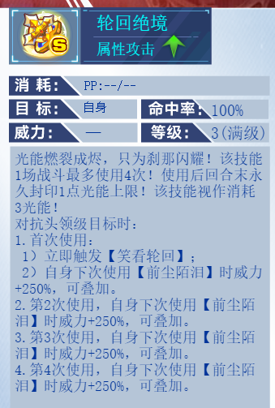
- **实战操作：**使用光烬特技-使用其他技能/吃药-使用光烬特技-使用二光技能
- **注意事项：**理论上最多可以叠4刀,获得被动的最终伤害增加40%,但黑梅的二光技能攻击次数为**4**,能造成的**伤害上限**为999999×4,因此如果boss的体力远高于400w (例如600w) 就不要想着叠四次一刀打死了,叠两次打一次即可.

- **4. 芙蕾雅为什么没有二光**

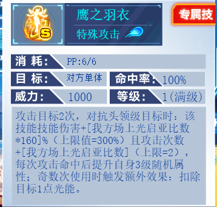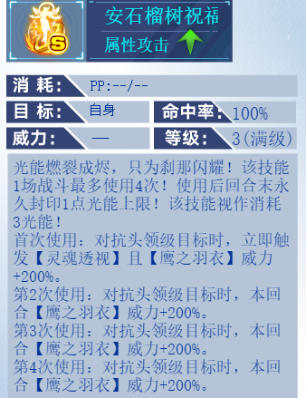

- 芙蕾雅的专属技能鹰之羽衣消耗pp而不是2光能,设计初衷可能包括配合奥丁体系队(出手前光能越少伤害越高)和针对强力boss启元龙母(概率化解消耗光能的技能).但也带来了需要补充pp的问题.
- **5. 固伤也是伤害**
- **机制补充：**固定伤害无法暴击,也不受伤害加成、威力、克制倍率等加成影响,影响固定伤害的只有标明增加/减少固定伤害的效果和真实抗性(详见第九章).
  

提亚玛特、一生一世和米迦勒的每次攻击会附带**直接伤害50%的固伤**

潘多拉每次攻击扣除boss**最大体力的1%也是固伤**,潘多拉和密涅瓦**形态首次互相切换**时**扣除boss最大体力的10%也是固伤**, boss剩余血量较少时可补刀.

但boss**免疫非克制伤害**时会将固伤也一并免疫,从而使这些打手丢失大量伤害

此外部分boss也会免疫固伤,需要注意.有条件时还是用别的打手吧.

- **注：**虽然命卡等魂卡和魂器灯可以增加**固定伤害**,但大部分情况下这些光烬主要伤害来源还是**直接伤害**,不要舍本逐末,仍推荐携带常规的魂卡魂器.
- **6. 随机的魅力**
  

- 死神弥尔、伊西斯、艾蕾和无祸女皇的技能均带有随机成分,且弥尔和伊西斯的数值跟不上时代,无祸女皇没有群星,均不建议使用.艾蕾虽然数值不错,但由于随机性太大且系别尴尬,仅作娱乐推荐,很少作为最佳选择.
- **7. 那是因为我还没有启动**
  海纳百川的光烬特技效果是每次使用后获得**永久强化**,属于需要发育的亚比,四次光烬用完自带buff才完整,但注意光启时代的buff都是有回合限制的,导致其有效输出回合变少,虽然能持续输出,但总伤害并不算高,且水系克制面相对一般,挑战控制回合数较麻烦,不建议培养.有**星环冰雪女皇**作为其上位.

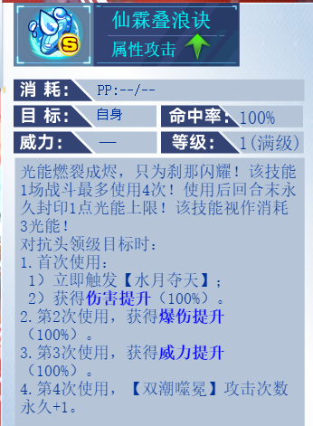

- **8. 反击核心**

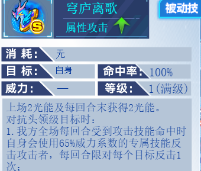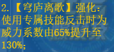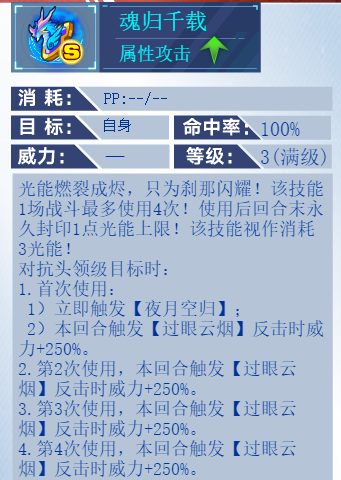

光烬昭君的**光烬特技强化本回合反击时的威力**,因此其主要伤害来源是**反击.**如果**boss先出手**,**使用光烬前就会反击**,浪费一次**光烬特技**,这是使用时需要注意的问题.推荐使用my登录器的辅助功能-对战助手查看boss光能数,在boss**不能释放大招**时(2/4光能)使用光烬特技.

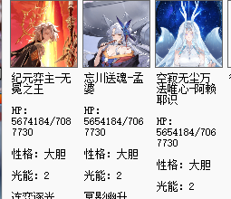(该功能可能有延迟,可以等几秒或自行推算)

- **注：**目前昭君只能10奥币购买,最主要的就业是纪元弈主-无冕之王的挑战,昭君本身是超上古的优秀打手,无冕则是超王系的优秀打手,但暂时在其他亚比的挑战中都不是必需的,因此还是推荐大家量力而行.

### 光烬亚比养成推荐

- **T0**<版本答案,自身强度高,适用范围极多,出场率极高,平民必养>
- **提名亚比**：
- **1. 后土玄黄-岁岁祈**：无限光烬,持久作战
- 只需要放一次光烬二光,之后的二光就一直是光烬加成的伤害;连击型;二光拥有削属性补护盾功能,长久作战能力极佳,鏖战首选,且伤害不低,有群星补强;克制面优秀,出场机会极高;获取难度极低,**可白嫖王专**.
- **伤害能力：★★★★☆**
- **应用范围：★★★★★**
- **推荐程度：★★★★★**
- **2. 黑暗轮回女神-梅比乌斯**：光烬唯一独特叠刀机制,爆发极高
- 攻击段数优秀、数值优秀、上限极高;圣灵系别克制面优秀;拥有群星,且在免费亚比中没有替代.
- **伤害能力：★★★★★**
- **应用范围：★★★★★**
- **推荐程度：★★★★★**
- **3 月渊万相-艾琳**：数值之美,光烬输出天花板
- 伤害非常恐怖,打平系也有高伤害;可以针对新晋evp幻神秘宝伊撒尔;不带群星组成双c阵容也有良好表现;4v2和6v1都有极佳表现.
- **伤害能力：★★★★★★**
- **应用范围：★★★★★**
- **推荐程度：★★★★★**
- **4. 全知与曦光-密涅瓦×潘多拉**：双属性光烬,练一只相当于练两只
- 伤害较高;神秘系和火系双形态,克制面较广;神秘系可以作为阿格的上位替代,且自带无光时有奇效;超火自带克制倍率;切换形态高额固伤斩杀
- **伤害能力：★★★★★**
- **应用范围：★★★★★**
- **推荐程度：★★★★★**

- **T1**<版本次选,自身强度高,出场率中等,有资源可以养,不亏>
- **提名亚比**：
- **1. 星月交辉-一生一世**：可辅可攻双功能光烬
- 伤害属于光烬较高水平;可作为无冕站场辅助,亦可作为打手;系别出场率高;**王专新手福利白送**.
- **伤害能力：★★★★☆**
- **应用范围：★★★★★**
- **推荐程度：★★★★☆**
- **2. 万物之美繁荣之源-芙蕾雅**：唯一pp值光烬
- 伤害属于光烬较高水平;出场机会较多;启元龙母克星之一,**可白嫖王专.**
- **伤害能力：★★★★☆**
- **应用范围：★★★★★**
- **推荐程度：★★★★☆**
- **3. 恶魔的私语-路西法**：强力群体输出光烬
- 42加成极高;电系克制面得天独厚;拥有群星;输出极高、出场率极高;伤害爆炸,但目前在4v2中可以与神霆点苍-奇灵王互相替代.
- **伤害能力：★★★★★**
- **应用范围：★★★★★**
- **推荐程度：★★★★☆**

- **4. 尼伯龙根之主-法芙娜**：卡奥斯体系最常用副c
- 伤害相对不错,追求最大化需要环卡;克制面不错;可作卡奥斯体系队副c.
- **伤害能力：★★★★☆**
- **应用范围：★★★★☆**
- **推荐程度：★★★★☆**
- **5. 穹庐离歌-王昭君****：**反击型光烬
- 伤害属于光烬一档水平;每个boss都可反击一次;可配合反击唤灵体系;但需要10奥币,推荐程度稍低于前四位.
- **伤害能力：★★★★★**
- **应用范围：★★★☆☆**
- **推荐程度：★★★★☆**

- **T2**<三挡补强选择,有群星强度够,出场率中等,有机会可以补王专>
- **推荐程度：★★★☆☆**
- **提名亚比**：
- 姬露比：克制面优秀,伤害高,但大部分情况可用两代无冕代替.
- 阿格蕾亚：老牌光烬,克制面优秀,伤害不错,但有密**潘**为上位替代.
- 阿波菲斯：克制面和机制优秀但数值稍低,唤灵盘古为其上位替代.
- 二代梦****：攻击全场,白送王专,可以先凑合用.三代梦为上位替代.

- **T3**<克制面或者数值必有一尴尬,基本上都有替代,随缘培养即可>
- 仅代表个人意见.
- 数值不错但克制面一般的：夜兰、艾蕾、米迦勒、波旬、海纳百川.
- 数值明显跟不上了的：白海蒂、弥尔、伊西斯、三代赫.
- 暂时没群星的：提亚玛特、瑠璃、尤尼梅特、真理之后、无祸女皇.

## 其他6v1常用打手亚比

### 低数值打手

除了光烬亚比外,相当一部分亚比的技能也会包括对头领生效的效果.然而其中一部分亚比获得方式简单,一般技能强度不会太高,只能作为娱乐用或流星十二宫等低数值挑战中使用,部分送王专的可以作为前期过渡打手.以下进行简单介绍,非常不建议专门买这些亚比的王专.

- **1. 只有旧技能组的打手**
- 典型代表为铸星亚比皇帝系列、一代梦、虚空龙灵、一代夜樱、超神秘系赫耳墨斯等,均是早期打手,**数值大部分明显跟不上时代**,不建议前期培养.
- 部分亚比**新技能组数值较高或本身水平极其出色**,将在3.5.3介绍.
- **2. 版本之子亚比**
- 大招会自爆的版本之子：
- 代表为沙僧、妖王冽等,作为输出时无脑使用专属小技能即可.实际上一般使用**妖王冽**也是为了**触发关卡buff**,这种情况无需专属.不建议前期培养.
- 大招不自爆的版本之子：
- 代表为**月副本**获得的**光启超维**亚比,每个月当月的月副本可获得王专.大部分的主要输出来源是使用大招后获得四次专属技能强化.1这些亚比收藏价值大于实战价值,就算有数值较高的也有更好选择,**不建议前期培养**.
- **注：**超维系统使用前需要花系统强化石点系统中的双攻、暴击、爆伤加成.
- **3. 群星亚比和神兵亚比**
  群星亚比和神兵亚比技能也带有对boss的增伤.与版本之子不同,大部分主要输出来源为**大招**,因此使用时辅助最好带**星尘**.群星亚比和神兵亚比的**数值稍高**于版本之子,有时甚至可以应用于幻想史诗.但并不建议特意去补王专,慢慢白嫖即可.**群星亚比推荐培养**,因为有时还要应用于4v2站场.神兵亚比则不建议浪费前期的资源,用那些白嫖满战的即可(详见第五章).

### 体系队打手

体系队打手技能中带有较多**场上亚比数=2的加成**,一般在6v1使用时需要年费阿比斯拉人.有年费阿比斯拉人的情况下,体系队打手则都可以用于6v1挑战.本节简单介绍**不需要阿比斯拉人**也有较高伤害的体系队打手,这些打手一般自身数值足够优秀,不吃场上亚比数=2的加成也有较高的伤害.

- **1. 缔界师亚比**
- **使用方法一般为叠几回合咸鱼-开缔界-三次专属技能+一次大招/四次专属.**注意携带**系统契约的亚比**帮助**攒能量**,并叠对应**普攻/特攻**,有数值加成.
- **推荐使用：**月亮星诺(超暗系特攻打手,白送王专,伤害不俗)、星诺玛(不朽系特攻打手,低数值可用,等待后续群星补强)、白梅(仙灵系普攻打手,白送满战,但数值较低,目前也没群星,只建议前期使用).
- **配队：群星+星诺f4+缔界师**,星诺自爆即可攒够能量.白梅直接用常规配队.
- **有上位替代：**盘古、奥丁、卡奥斯,这三个体系队也不建议前期培养.
- **2. 英雄亚比(系统为xx神域)**
- **命运审判**伤害较高,但小技能和大招伤害也不低**,有大开大.**
- **推荐使用：**审神无冕(超王系特攻打手,白送王专,机制完整,克制面优秀,伤害不俗)、阿蒙王(超上古系特攻打手,白送王专,机制交互较尴尬,低数值可用)、奇灵王(超电系普攻打手,数值高,克制面优秀).
- **配队：群星+f4+英雄.**如果有阿比斯,拉契约站场亚比.
- \*\*\*\*逍遥一般有岁岁祈替代,双梵天有上位替代(唤灵圣天伊/艾琳),神羲和有白送王专的芙蕾雅作为替代.而露易丝、不朽龙和天使王的克制面相对一般.
- **3. 至高荣耀**
- 至高荣耀系统无需阿比斯拉人也可以应用于6v1,但相对更依赖王专.
- **6v1可用：至高龙母**(超神秘系特攻打手,穿防高,克制面优秀,伤害不俗,6v1伤害远高于其他至高荣耀亚比,但密潘/阿格可替代)、至高羲和(超时空特攻打手)、至高火凤(超火普攻打手).羲和和火凤数值中等,其他三个暂无群星.
- **配队：任意三个至高荣耀亚比+群星+女皇+至高打手**
- 女皇可以提供暴击、锁属和护属,增加阵容稳定性,可换为其他增伤亚比.只有背包中**至高荣耀数亚比=4**时才可以触发加成效果,实际上自爆1只就足够了.
- **4. 唤灵使体系**
- 唤灵使本人数值很高,无需阿比斯拉人也可以应用于6v1.星环师也可用.注意6v1开唤灵技慢很正常,依靠专属技能和大招也可以轻松打出高伤害.
- **推荐使用：**唤灵星诺玛(生命系特攻打手,可轻松获取,克制面一般,但是打不克制亚比也有最终伤害加成,且可以完美契合星诺f4)、**唤灵圣天伊**(超光系普攻打手,可轻松获取,克制面较好,连击多,数值极高,非常推荐养成)、**唤灵盘古**(超土系普攻打手,可轻松获取,克制面好,数值高,非常推荐养成).
- **配队：群星+f4/星诺f4+唤灵使.**如果有阿比斯,拉对应体系的星环师.
- 星环女皇和星环女娲也可以用于61,但女皇克制面一般,女娲无群星.

### 其他常用打手

- **1. 梦幻缔约系统**

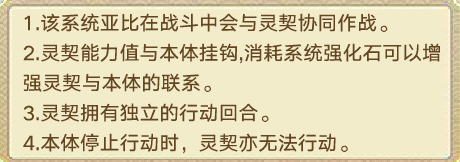

- **系统讲解：**简单理解为有一个自动释放的额外技能,系统强化满时,释放该技能时的能力值视为为本体的110%.
- **亚比简介：**
- **(1)\*\***一桥一诺一相逢-梦 黯星系 特攻\*\*
- 简称**三代梦**.系统技2回合一次,和专属技能均为**攻击全场**.数值远高于光烬梦,自带回pp.6v1伤害不错,也可在4v2作为单c或组成双c阵容.但挑战对练度有一定要求且不能借用亚比,可以考虑活动自选.
- 使用时**一直用专属技能**即可(大招伤害偏低).pve**不需要璀璨版！**
- **(2) 世外录-天女 超数码系 特攻**
- 系统技1回合一次,数值非常高,克制面很广.6v1伤害很高,阿比斯可以作为平替.技能没有4v2额外加成且只能攻击单体,但目前在4v2中表现仍然优秀.但挑战对练度有高要求,可以**借大佬的亚比**,会轻松很多.
- 使用时**一直用专属技能**(1光)即可(大招伤害偏低).
- 推荐程度较高,如果能获得建议重点培养,但非常不建议星币购买本体.
- (3) 星芒蜕蝶-时舞 超时空系**普攻**
  系统技6回合一次,**上场获得4层蝶舞,每回合首次攻击命中时消耗1层并立刻释放一次系统技.大招伤害高于小技能,需要配合星尘使用.6v1伤害部分情况高于法芙娜,但4v2能力很差.**需要手游兑换码,优点是白送王专满战.

- **2. 其他数值较高打手**
- \***\*仅作出简要介绍,如果已经有专属可使用,**不推荐前期专门获取和培养.\*\*
- **(1) 纪元弈主-无冕之王 超王系 特攻**
- \***\*克制面广,发育完拥有高威力和段数,自带高能力值、伤害、威力和爆伤加成,自带回pp.在背包中即可发育,6v1伤害非常出色,4v2也可以使用但需要发育几回合.但挑战难度较高且不可借亚比.目前就业**均可被审神无冕替代\*\*,不是必需.常规阵容即可,使用专属技能和大招输出,系统在pve时不用管.
- **(2) 鸿雁知音-王昭君 超上古系 特攻**
- 伤害不俗但克制面一般,一般配合星尘使用.最初获得需要10奥币,现已可在活动自选和商城购物金购买.可用三代昭君代替.
- **(3) 万神之王-宙斯 超电系 普攻**
- 伤害很高,一般配合星尘使用.最初获得需要星币购买,现已可在活动自选或域界的亚比大集结获得.有路西法和奇灵王作为替代.
- **(4) 墟尽神临之噬-赫耳墨斯/噬界傀人-赫耳墨斯 完全系/超暗系 特攻**
- \*\*\*\*两人共用专属,技能也几乎一样,但属性不同.虽然伤害非常高,但其中傀人已绝版,也有其他替代,不必需;完全系克制面较差.依靠系统技能输出,自动循环释放,但需要收集前四代赫耳墨斯,且战斗时会有一定卡顿.
- **(5) 暗月千面-艾琳\*\***超暗系 普攻\*\*
- **使用新技能组.**数值不错,但光烬艾琳是其上位替代,且获取非常容易.
- **(6) 引尘造万物-星尘\*\***黯星系 特攻\*\*
- **使用新技能组.新技能组数值很高,**6v1极限伤害持平三代梦,专属技能攻击次数为6,可以作为卡奥斯体系队的副c,但这只是一种娱乐玩法,不必需.
- **(7) 荒宇独霸-帝皇龙\*\***超龙系 普攻\*\*
- **使用新技能组.**数值不错,但1314可以作为替代,伤害差距不大.
- **(8) 希望永存世间-潘多拉\*\***超神秘系 特攻 固伤\*\*
  老牌固伤打手,每次攻击扣取2%最大体力,上限100000.2光攻击2次,大招随机攻击1-7次.攻击还可以给boss无光,增加化解概率.一般配合龙王、星尘、逍遥等亚比使用,运气成分较大从而有高上限.不必需.

- **(9) 秘宝、年费等氪金亚比 详见附录**

## 全系别亚比6v1打手推荐

- **(带★的为推荐养成系别)(标\*的该结论建立在阿比斯拉人前提下)**

- 超**木**系****克制光、乾坤、水

- **最推荐：光烬夜兰 实用性：**光烬夜兰**伤害：**光烬夜兰

- 超**水**系克制暗、时空、不朽、火

- **最推荐：星环女皇\*\***实用性：**星环女皇**伤害：\*_星环女皇_

- 超**火**系克制龙、神、生命、木

- **最推荐：光烬密潘\*\***实用性：**光烬**密**潘**伤害：**光烬**密\*\*潘

- 超**土**系克制湮灭、火、圣灵、飞行、电**★**

- **最推荐：唤灵盘古\*\***实用性：**唤灵盘古**伤害：\*_唤灵盘古_

- 超**电**系克制时空、王、水、飞行、虚境、数码**★**

- **最推荐：英雄奇灵王/路西法 实用性：**英雄奇灵王/路西法
- **伤害：**英雄奇灵王\*

- 超**光**系克制电、数码、格斗、暗**★**

- **最推荐：唤灵圣天伊\*\***实用性：**唤灵圣天伊**伤害：\*_唤灵圣天伊_

- 超**暗**系克制电、土、不朽、龙**★**

- **最推荐：光烬艾琳\*\***实用性：**光烬艾琳**伤害：\*\*光烬艾琳

- 超**龙**系克制土、数码、仙灵、格斗、光**★**

- **最推荐：1314 实用性：**1314/秘宝132**伤害：**秘宝伊撒尔

- 超**上古**系克制仙灵、虚境、王

- **最推荐：阿蒙王\*\***实用性：**秘宝星龙**伤害：\*\*秘宝星龙

- 超**数码**系克制木、上古、神秘、仙灵、神兵、土**★**

- **最推荐：天女\*\***实用性：**阿比斯**伤害：\*\*阿比斯

- 超**圣灵**系克制电、神、湮灭、上古**★**

- **最推荐：黑梅比 实用性：**黑梅比/阿波罗**伤害：**阿波罗

- 超**王**系克制火、木、永恒、圣灵**★**

- **最推荐**：**审神无冕 实用性：**审神无冕/弈主无冕**伤害：**弈主无冕

**完全**系克制王、圣灵、湮灭

- **最推荐：五代赫/光烬真理\*\***实用性：**五代赫/光烬真理**伤害：\*\*五代赫

**乾坤**系克制龙、暗、光、黯星、完全**★**

- **最推荐：光烬岁岁祈\*\***实用性：**光烬岁岁祈**伤害：\*\*光烬岁岁祈

- 超**神**系克制王、乾坤、永恒、神秘**★**

- **最推荐：芙蕾雅\*\***实用性：**芙蕾雅/神羲和**伤害：\*_神羲和/缔界奥丁_

- 超**时空**系克制土、圣灵、神

- **最推荐：时舞\*\***实用性：**法芙娜**伤害：\*_露易丝_

- 超**神秘**系克制火、龙、黯星、神兵、时空**★**

- **最推荐：光烬密潘 实用性：**光烬密潘/六代赫**伤害：**六代赫**\***

**湮灭**系克制水、时空、神秘、乾坤

- **最推荐：**光烬**提玛\*\***实用性：**光烬提玛**伤害：\*_光烬提玛_

**仙灵**系克制神、电、乾坤、虚境

- **最推荐：星环女娲\*\***实用性：**星环女娲**伤害：\*_星环女娲_

**黯星**系****克制湮灭、上古、光、生命、仙灵

- **最推荐：三代梦\*\***实用性：**三代梦**伤害：\*\*三代梦

**虚境**系克制暗、王、完全、黯星

- **最推荐：英雄逍遥/鱼肠(需星尘)\*\***实用性：**英雄逍遥**伤害：\*_英雄逍遥_

**永恒**系克制湮灭、时空、木、不朽

- **最推荐：英雄阿卜苏\*\***实用性：**英雄阿卜苏**伤害：\*_英雄阿卜苏_

**神兵**系克制王、仙灵、电、木、飞

- **最推荐：波旬\*\***实用性：**波旬**伤害：\*\*波旬

**格斗**系克制暗、仙灵、圣灵、神兵

- **最推荐：艾蕾\*\***实用性：**艾蕾**伤害：\*\*艾蕾

**飞行**系克制虚境、木、神秘、格斗

- **最推荐：英雄天使王\*\***实用性：**英雄天使王**伤害：\*\*英雄天使王

**生命**系克制湮灭、虚境、龙、永恒

- **最推荐：唤灵星诺玛\*\***实用性：**唤灵星诺玛**伤害：\*\*唤灵星诺玛

**不朽**系克制黯星、完全、上古、生命

- **最推荐：缔界星诺玛/不朽龙\*\***实用性：\*\*缔界星诺玛/不朽龙/渡
- **伤害：**渡(带生命系群星)

**逆上古**系克制超圣灵、超龙、完全、永恒、超格斗

- **唯一打手为秘宝星龙的星神之躯,详见附录.**
