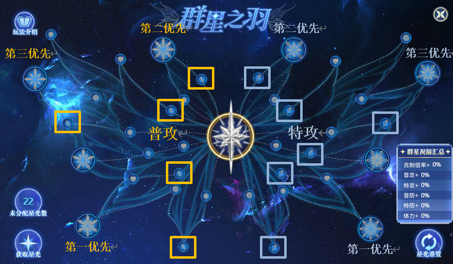
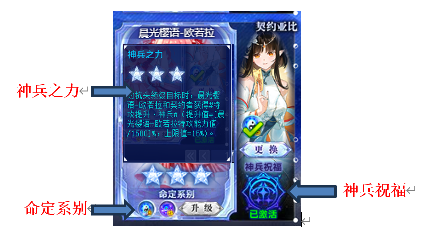

# 亚比介绍

本章介绍亚比的技能及作用。

## 基本机制补充

### 技能优先度

- **光启面对非光启**拥有99%真抗，获得boss化能力，不等于boss。非光启亚比pvp生效的斩杀/重置对光启亚比不生效；星辉面对非星辉非光启，拥有95%真抗，视为boss。非星辉非光启亚比pvp生效的斩杀/重置对星辉亚比不生效

- **技能先发度：光启爆发技**>超星辉必杀>异次元必杀>传奇必杀>超奥义>**光启小技能**>星辉小技能>异次元小技能>传奇小技能>究极变身 注意**光启不同系统先发度不同。例如光烬的先发度等于光启小技能。**
- 注意部分技能会标注先**发度等于光启爆发技，如至高祝福。**
- 超快先发度+1>超快>普通
- (1) 必杀优先级
- 光启爆发技先发度+1>光启爆发技>超星辉必杀超快速度>超星辉必杀>异次元必杀超快速度>异次元必杀>传奇必杀
- (2) 小技能优先级
- **光启先发光能技能>光启光能技能>光启先发pp技能>光启pp技能**>星辉三星先发>星辉三星>星辉技能>异次元先发技能>异次元普通>后发
- (3)**切亚比先发度**
- **光启爆发>星辉爆发>切亚比>嗑药>小技能**
- 光启/星辉/异次元/传奇/奥义**正常大招优先级跨时代大于普通小技能 比如：星辉大招/异次元大招/超奥义快于光启小技能。**

### 伤害抗性：真抗与假抗

- **真抗：减少一切伤害。**红色直伤(技能直接伤害)，紫色固伤(扣除、吸取、百分比)，因此可以**减少黄色总伤害。亚比中只有[色欲之罪]凯撒可以削弱。**
- **假抗：只能减少红色直伤。曰削弱的抗性是假抗。**
  :::tip
  技能单段红色直伤伤害上限999999(四舍五入为100 w)
  真抗的增减可以影响伤害上限。
  系统关卡给的#抗性提升#一般都是假抗；受到伤害降低是真抗。
  :::

### 攻击次数与连击数的区别

- **技能攻击多次(简称多段)和连击的是不一样的**
- **多段：一个技能一次能打出≥2个红色直伤**的就是多段技能。
- 技能描述为**攻击目标x次/攻击次数+x。**
- **连击：释放一个技能**后，**自动再次释放技能**的就是连击，技能描述为**连击。**

主要区别在于**多段只行动了一次；而连击行动多次**，因此攻击目标阵亡后，如果还有剩余的连击次数会追击其他目标/替换目标；多段不会。

- **攻击次数的buff和连击的buff**是不一样的，因此有必要区分这两个概念。
- **例：妖王冽的万妖百斩攻击次数+[1， 99] 多段**
- **光烬岁岁祈的连击一次该技能 连击**
- **卡奥斯体系队 攻击次数>5 多段**
- **圣天伊体系队 连击技能 连击**

## 通用辅助

(均为王者专属效果，数值均为上限数值，**带★的为常用辅助**)

- **辅助f4：**指**女皇、子牙、龙王、黑翼**，6v1通用辅助，其中女皇和子牙最重要，龙王其次，三者均可以首充获得，也可以星币获得。黑翼重要性相对低。

- **辅助f4：**指**女皇、子牙、龙王、黑翼**，6v1通用辅助，其中女皇和子牙最重要，龙王其次，三者均可以首充获得，也可以星币获得。黑翼重要性相对低。
- **1. 永霜寒玉-冰雪女皇★：自爆，削属、锁属、提属、暴击爆伤提升、保护属性**
  上场获得**5**光能，**扣除对方全场2光能**；大招牺牲自己**对单体无视保护**削弱**全属性6级**、**属性等级无法提升15回合**、**无视保护削弱15%数值**，我方**属性等级提升至最高，暴击率+100%，爆伤+200%，可继承，15回合。**下个出场亚比**受到直接伤害-99%，2回合**。1光技能**保护属性等级及能力值**，**可继承**，**15回合**。

- **注**很通用，6v1和4v2都必备，遇到削属性能力强的开护属。**不需要璀璨版！**

- **2. 代天封神-姜子牙★：自爆，能力值削弱、能力值提升、锁血**
  上场**满**光能，免疫所有技能**1**回合，赋予**敌方全场能力值降低当前值的50%，20回合；**大招牺牲自己，赋予**单体无法回复体力20回合；**首次离场(阵亡/切换均可)我方**全属性能力提升上场值的70%，单项上限15000，体力及上限提升上场值的50%，体力上限最多50000，可继承，20回合。**1光技能前两次使用**扣除敌方2光能**。

- **注：**常用于6v1，4v2有时候也可以用来站场。由于大部分光启boss回血较少，不一定要自爆。注意数值削弱当前值，部分boss可能有**星梦**，上场后提升能力值，只靠子牙无法削弱至最低，可以携带其他弱化亚比如女帝、火天使等。

- **3. 四海滔天-敖兴★：自爆，减伤、削属、概率化解、光能返还**
  上场获得**6**光能且**抗性提升80% 1回合**；大招牺牲自己，赋予单体**提升的属性等级回合末翻倍降低12**回合，我方亚比**受到直接伤害-60%**，**60%免疫攻击技能，回合末25%返还本回合消耗的光能，伤害提升150%，可继承，12回合**。

- **注**一般只在6v1使用，可以大大增加生存能力，返还光能也非常重要。

- **4. 绝影蚀月-黑翼王★：自爆，增伤、回血**
- 上场满光能**且提升自身体力及上限75%，全属性60%**；大招牺牲自己，赋予我方**伤害提升200%，每回合首次使用技能回复15000体力，可继承，20回合**。
- 6v1用，大部分打手每回合自带体力回复均为15000，面对伤害较高boss时可以变提高生存能力。伤害加成较少，可以换为别的辅助。

- **星诺f4：太阳、圣灵、龙和木四只星诺**功能相当于女皇、子牙、龙王和黑翼，但如果打手不是星诺家族亚比时，提供的增益只有75%效果，当打手数值较高或boss数值较低时也是完全够用。需要四只一起使用，否则加成会少。
- **5. 日曜奇迹-太阳星诺★：自爆，削属、锁属、提属、暴击爆伤提升、保护属性**
  上场获得**5**光能；大招牺牲自己**对单体无视保护**削弱**全属性6级**、**属性等级无法提升12/8回合**，我方**属性等级+6/4，暴击率+100%/75%，爆伤+200%/150%，可继承，15回合。**下个出场亚比**受到直接伤害-99%/75%，2回合。**小技能**100%/75%保护属性等级及能力值**，**可继承**，**15回合**。

- **注**由于太阳星诺可以带魂器，可以带锁链先用小技能保护属性。

- **7. 星光奇迹-圣灵星诺★：自爆，能力值削弱、能力值提升、锁血**
  上场**满**光能，赋予**敌方全场能力值降低当前值的50%，20回合；**大招牺牲自己，赋予**单体无法回复体力20回合；**首次离场(阵亡/切换均可)我方**全属性能力提升上场值的70%/52.5%，单项上限15000/11250，体力及上限提升上场值的50%/37.5%，体力上限最多50000/37500，可继承，20回合。**

- **8. 超界奇迹-龙星诺★：自爆，减伤、概率化解、光能返还**
  上场获得**5**光能且**抗性提升80% 1回合**；大招牺牲自己，我方亚比**受到直接伤害-60%/45%**，**60%/30%免疫攻击技能，回合末25%/18.75%返还本回合消耗的光能，伤害提升150%/112.5%，可继承，12回合**。

- **9. 天地与我竞争自由-逍遥：自爆、化解、能力禁锢、额外光能**
- **使用新技能组。**上场获得**4**光能；大招牺牲自己，赋予**敌方能力值无法提升5/7回合**；离场(阵亡/切换均可)赋予**下个出场亚比150%化解(2+敌方数/2，向下取整)次攻击技能3回合，冷却4回合，每回合未受伤害额外获得1光5回合。**
- **注**boss如果有精准buff，可能会无视我方化解，而逍遥提供的150%化解率一般不会被无视。用的较少，面对伤害很高的特殊亚比或配合固伤潘多拉使用。

- **10. 幻海奇迹-水星诺：自爆、化解、能力禁锢、额外光能**
  上场获得**4**光能；大招牺牲自己，赋予**敌方能力值无法提升5/7回合**；退场后(阵亡/切换均可)赋予**下个出场亚比100%/75%化解(2+敌方数/2，向下取整)次攻击技能5回合，每回合未受伤害100%/60%额外获得1光5回合。**

- **注**面对伤害很高的特殊亚比可以替换掉木星诺/龙星诺。

- **11. 群星之羽★**：**非自爆，相同系别我方亚比克制倍率、特攻/普攻数值加成**
- **使用时点击群星祝福后切换即可**，**详见3.2.**
- **注**6v1几乎必备，4v2也非好用，缺点是需要积累。

- **12. 版本之子：自爆，对指定系别boss伤害加成**
- 版本之子没有专门的系统，特征是大招自爆获得XX·攻，提供对**三个指定系别的boss增伤(绝大部分初始150%，异界225%，王专300%)**，**可继承，10回合**
- 根据boss属性选择版本之子速查如下：
- (1) [缘分一线牵-小狐仙]永恒、生命、不朽
- (2) [乐园守护者-星光角斗士]神兵、格斗、飞行
- (3) [冰封之心-伊莎女王]仙灵、黯星、虚境
- (4) [孤注一掷-骰子大王]数码、超土、超电
- (5) [午夜大冒险-黑夜童心]神兵、格斗、飞行
- (6) [寒冰之拳-冰拳艾司]上古、圣灵、超王**王专增伤350%，异界300%**
- (7) [大妖血脉-妖王冽]神秘、时空、超神**由于技能段数多，偶尔有用。**
- (8) [倾世之寒-始祖冰龙]超龙、超光、超暗**可免费获得王专**
- (9) [沙漠之心-阿努比斯]上古、超王、圣灵**可免费获得王专**
- (10) [卷帘大将-沙悟净]湮灭、乾坤、完全**可免费获得王专**
- (11) [天蓬元帅-猪八戒]超水、超火、超木**可免费获得王专**
- **获得方式：版本福利→签到礼→自选版本之子**
- **推荐**优先获得可白嫖专属的。其次骰子大王是神兵，契约亚比释放必杀即可增伤，可以给女皇绑定。因为自爆版本之子亚比已包含所有系别，此后出的版本之子亚比都是月副本(入口：挑战试炼→时光副本)可以白嫖的超维亚比。
- **注**异界和王专均可以上场自爆，一般在黑翼前自爆，否则黑翼的回血会让版本之子免死。版本之子由于伤害加成会被稀释，效果远远不如群星，一般挑战使用较少，实在缺伤害或者幻想史诗等封亚比的6v1才使用。

- **13**.**凝尘造界之星神-星尘**：**自爆，锁属、额外光能、威力提升**
- 上场获得**6**光能；大招牺牲自己，**下个出场**的亚比**每回合额外获得4光5回合**，**技能威力提升消耗光能数50%，最高200%**，**10**回合。
- pve一般配合**主要依靠大招输出**的亚比使用，也可以配合**光烬亚比**使用。

- **14**.**赤月刀姬-曰**：**非自爆，抗性削减、扣光**
- **每次攻击为目标**添加**1**层**赤月印记20回合**，**每层减少10%抗性，上限5层，最多削减至0%，抗性为0%时受伤增加100%**。2光赋予目标**光能流逝(每回合末扣除1光能，持续X回合，X为赤月印记层数**。离场时对敌方全场**自动使用一次2光技能**。快速叠印记可以使用**秘术飞剑(攻击体力比例比自身高的亚比可连击一次)，大招必定攻击两次**。
- **注**很少用，只在boss自带伤害抗性时有用，可配合缔结师奥丁，但很少用。

- **15. 甜蜜信使-愚者：自爆，单段伤害提升**
- 上场获得**5**光能；大招牺牲自己，使敌方**每回合受到**的**最高单段伤害附带60%固伤，**上限**60w，8回合。**
- **注**早期辅助，很少用，少有的就业是配合一代夜樱/潘多拉使用。

- **16. 尘世繁华-阿赖耶识：非自爆，回春、光能定格、威力提升**
  上场**满**光能；大招**使威力提升30%消耗光能数**，**上限180%**，**可继承，10回合；**离场赋予**下个亚比1次回春(受到致命伤害时回复25%最大体力，上限20000)和双防提升上场值20%各15回合，锁定光能3回合。2光逼退自身。**

- **注**早期辅助，想配合大招型打手还需要提前上场攒光，**基本已被星尘替代**。

- **17. 时音弥漫·洛羲：自爆，伤害提升(星辉亚比)**
- 上场**5**星，大招牺牲自己，使**我方亚比每回合伤害+20%，上限200%，可继承，无限回合**
- **注**早期辅助，由于结算问题和需要发育，是黑翼王的下位替代。

- **18. 梦幻绮丽之夜-羲和：非自爆，吸血，爆伤(星辉亚比)**
- 上场给敌方添加梦幻印记，攻击带印记目标**吸血+100%**，**爆伤+50%**，**无限回合**
- **注**早期辅助，适合高伤害目标保证续航，也可以配合渡使用。

- **以下辅助效果与我方在场亚比数有关，=2时最大(红色数字)，=1时蓝色数字**
- **19. 寰宇皆臣-女帝★：自爆，削属弱化、特攻亚比伤害提升**
- 上场**满**光能；大招牺牲自己，**削弱敌方全场6级全属性，弱化(全属性能力值降低50%/25%)10回合；我方获得特攻技能伤害提升200%/100%，可继承，10回合；下个亚比立刻获得4光能。**
- **注：**4v2**特攻**亚比**通用**辅助，而且免费王专。上场会**扣除自己20%体力**，因此**无法触发锁链魂器**。黑翼王祝福/**源卡**可以使其自爆后不死。

- **20. 幽泉使者-孟婆★：自爆，削属、弱化、特攻亚比爆伤提升**
  上场**满**光能，**扣除对位3光能**；大招牺牲自己，**削弱敌方全场6级全属性，弱化(全属性能力值降低50%/25%)10回合；我方获得特攻技能爆伤提升200%/100%，可继承，10回合；下个亚比立刻获得4光能。**

- **注：**4v2**特攻**亚比**通用**辅助。孟婆和女帝哪个伤害高，取决于你的输出有没有自带爆伤。如果输出自带很多爆伤，就用女帝，反之孟婆。
- **双弱化打法**：可以通过**魂器携带锁链**实现**自爆**不死。由于锁链锁血1回合，配合愈卡回合末回血，可以第二回合替换下场，等到弱化和爆伤加成结束后替换站场辅助上场，通过凹对方不攻击孟婆，实现**再次自爆**，相当于**延长了buff的回合数**，需要运气但可以有效增加伤害，配置实在不够时可以考虑这个打法。

- **21. 圣火炽天使-塞勒芙★：自爆，弱化、普攻亚比爆伤提升**
- 上场**满**光能；大招牺牲自己，**削弱敌方全场6级全属性，弱化(全属性能力值降低50%/25%)10回合；我方获得普攻技能爆伤提升200%/100%，可继承，10回合；下个亚比立刻获得4光能。**
- **注：**4v2**普攻**亚比**通用**辅助，达人王免费获得本体及王专。召唤阵和神宠秘境也能获得本体。

- **22. 无名无始之境-阿赖耶识★：非自爆，提属、特攻亚比暴击提升、威力提升**
- **大招释放后立即返回背包**，赋予队友**受到攻击使用专属技能反击一次**，**特攻技能暴击率提升100%/50%，威力提升150%/75%**，**可继承，10回合；首次离场**赋予**我方全体6级全属性等级(仅包括目前在场亚比和替换亚比，不可继承)**。
- **注：**4v2**特攻**亚比**通用**辅助，而且免费王专。同样是提升暴击率和属性等级，但一般**效果并不如冰雪女皇**，除非是梵天队这样的**双特攻c**队伍，但梵天队也有上位替代。还有一个优势是可以**提升站场辅助等级**，增加生存能力。此外，可以在6v1中被阿比斯拉出来作为站场亚比，大招可以套反击增加输出。

- **23. 月影映夜澜-夜樱★：非自爆，提属、普攻亚比暴击提升、威力提升**
- **大招释放后立即返回背包**，**驱散对方2个最新获得且回合数＜10的增益效果**，赋予队友**普攻技能暴击率提升100%/50%，威力提升150%/75%**，**可继承，10回合；首次离场**赋予**我方全体6级全属性等级(仅包括目前在场亚比和替换亚比，不可继承)**。小技能可以赋予目标**2**次**受伤提高40%**，**3**回合。
- **注：**4v2**普攻**亚比**通用**辅助，一般**效果并不如冰雪女皇**，用的也相对较少，一般用于站场辅助非常容易被直接伤害打死的普攻队伍或普攻双c队伍。

## 群星之羽(辅助)

群星之羽亚比简称**群星**，是非常重要的辅助，6v1和4v2都很常用。

带有此系统图标的亚比即为群星之羽亚比，有时也称为**流星之子**。

- **群星作用：**对抗**群星系别克制的**敌人时，使用群星辅助**同系别**打手可以获得强大的**克制倍率和数值加成**，增伤效果非常明显。
- **群星点数：点击系统中的获得星光，**每个群星亚比**本体**和**装备王者专属各**算一个星光数(异界不能)。每个星光数需要消耗**100系统强化石**获取。
- **群星点分配**：点击图标即可点亮。左半边为**普攻**区域，右半边为**特攻**区域。切记**克制倍率优先级最高**。优先点第一优先的**大星**，点数不够时优先点小的**特攻/普攻**点。图中没有体现，群星配置目前已经可以**存成预设**，建议普攻特攻各一套。
- **群星使用**：群星首发时无等级限制，非首发时需满级，**点击群星之羽**图标即可获得群星祝福。群星技能释放的**先发度**取决于本回合操作，一般吃药/切亚比。
- **群星祝福：10/15**回合，获得群星之羽系所有加成，**可继承**给**下一个**同系别亚比。
- **注：**群星使用后切换的亚**跟群星系别不同**，再切换成同系别的亚比，群星祝福仍可以继承(例：圣灵→王→圣灵依然可以继承祝福)且中途不计算回合数。
- 如果切换到**同系别**的亚比吃到群星祝福之后，**再次切换**会使群星祝福消失。
- (例：龙吟守→龙王→1314，1314是吃不到群星祝福的)
- 群星祝福只给**自己以及自己切换**到的亚比，不是全场，4v2尤其注意。阿比斯拉群星站场前不要忘记开群星祝福；
- 租借过来的群星点数使用的是**自己的**群星点数。亚比**获得群星祝福**后，切换属性(如渡、星龙变身，密潘切换神格)仍可继续使用祝福。
- **速查表(1-16可以召唤阵换取本体，1-19可以域界兑换本体及王专，21可以当期通行证免费获得本体，30奥币获得王专。此外部分活动也可能增送)**：
- (1) [驱灵神捕-琳琅]超神系群星★
- (2) [1号机-图灵]超数码系群星★
- (3) [余烬初王-洛兰]超王系群星★
- (4) [冰龙之子-冰罗皇]超水系群星
- (5) [翼龙之子-凌风]超电系群星★
- (6) [翼龙之子-银风]超飞行系群星
- (7) [影龙之子-帝卡]超光系群星★
- (8) [巨龙之子-明王]超土系群星★
- (9) [龙魂之矢-龙吟守]超龙系群星★
- (10) [冰凝之魂-雪无寒灵-]超圣灵系群星★
- (11) [幽星荒主-天元夜神]超木系群星
- (12) [漫游星境-小熊座]超神秘系群星★
- (13) [涅槃至尊-雀皇紫辰]超暗系群星★
- (14) [巡航迅影-利飞]超火系群星
- (15) [寒霜利刃-烈魄]超神兵系群星
- (16) [重击雷霆-铁拳袋鼠]超格斗系群星
- (17) [时渊裂缝-时间之神]超时空系群星★
- (18) [红莲尽染-御星璃]超上古系群星
- (19) [圣咏御天使-银]超乾坤系群星★
- (20) [黑渊黯翼-混沌巨龙]黯星系群星
- (21) [玉魂巫女-花萤姬]生命系群星
- **注**：异界和王专可以额外提升**25**克制倍率。其他效果均为增伤(群星也可以作为数值较低的打手)，没有也不影响使用。但是站场需要培养提高肉度。

## 神兵亚比(局外辅助)

- **光启神兵**亚比简称神兵，在系统中绑定后，无需出战即可使亚比获得一定加成。
- 带有此系统图标的亚比即为**光启神兵**亚比，且属性为xx系+超神兵系
  

- **神兵契约后，**可为**所有亚比**提供**神兵之力**，只为**命定系别**亚比提供**神兵祝福**。
- **神兵之力：**只要契约即可获得神兵对应的**能力值加成，随神兵系统等级提高**。
- **注**：实际上能力值加成**无上限**，且不是按照神兵亚比本身的数值提升，是按照**绑定亚比数值**的百分比提升(系统满级后为[绑定亚比能力值/1500]%)。
- 这意味着**加成跟神兵本体没有关系**！神兵**不用养成**，需要第二系别给异界即可，除非钱多或者能白嫖，最后再考虑给常用神兵王者。
- **命定系别：**一个神兵**一般**有**两个命定系别**，分别是神兵亚比本身的系别+一个额外命定系别。异界和王者均可开启第二命定系别。
- **神兵祝福：**只有契约的亚比系别跟神兵的两个**命定系别**一样时，才可以激活神兵祝福。神兵祝福随着神兵系统等级提高而提高，**王者专属**才能**额外提升**。
- 每个神兵需要**200系统强化石**才能将系统升满。
- 神兵祝福无特殊情况都是**持续20回合**，**首次上场生效**，**替换消失**。一旦获得神兵祝福后，切换形态等使属性发生改变，不会使神兵祝福消失。
- **常见神兵祝福类型**(数值均为**总伤害提升值**)：
- **伤害提升·神兵 提供伤害加成**
- **神兵之力**加成是**10**的：
- 初始伤害提升**5%**；**系统满级**伤害提升**35%**；**装备王专**伤害提升**60%**。
- **神兵之力**加成是**15**的
- 初始伤害提升**30%**；**系统满级**伤害提升**60%**；**装备王专**伤害提升**100%**。
- **2. 爆伤提升·神兵**提供爆伤加成**目前只有**洛羲和圣天伊
- **神兵之力**加成均为**15%**
- 初始爆伤提升**10%**；**系统满级**爆伤提升**60%**；**装备王专**爆伤提升**120%**。
- **注：**神兵和绑定亚比需**相同技能组**〈使用**新技能组神兵**绑定**旧技能组亚比**，旧技能组亚比依旧**可以**吃到祝福，但是使用**旧技能组**绑定**新技能组**亚比**吃不到加成**〉
- **旧神兵**绑**旧技能组亚比**提升的数值会显示在**局外面板**上，故**pvp，pve都生效**；**新技能组**神兵提升的数值**不显示**在背包亚比面板上，战斗内显示，只在对抗头领 (pve) 时生效， PVP中神兵只有攻击特效和buff显示，但实际上并没有加成。
- **6v1推荐数值神兵**(特攻/普攻与打手一致，优先吃到**神兵之力**加成)，**4v2**则能吃到**神兵祝福**更佳，当然两个都能吃到更好。
- **一只神兵亚比只能契约一个亚比。**点击系统界面的**所有神兵**，可以**快捷更换**所有神兵绑定的亚比，同时可以查看所有神兵亚比(包括未获得)的命定属性。
- **速查表(亚比名-命定系别/第二命定系别-神兵之力-神兵祝福，满级系统)**：
- (1) [戮器仁心-帝刃]超上古系/超王系 普攻提升**10%**伤害提升**35%/60%**
- **注**可白嫖满战。**有旧技能组和新技能组**。
- (2) [神兵护佑-圣盾]超上古系 特防提升 与人作战时获得护盾
- **注：**可白嫖满战。但**只有旧技能组**，pve用处很少，pvp如今也几乎没用了。
- (3) [幽冥千练-鬼墨无忧]完全系/超火系 特攻提升**10%**伤害提升**35%/60%**
- **注：有旧技能组和新技能组**。
- (4) [逐梦追光-布灵灵]超王系 特攻提升 与人作战时提升双防、暴击1级。
- **注：只有旧技能组，给英雄无冕绑定毫无用处**可以给启元麒麟，多排/狂野。
- (5) [王者加冕-圣天伊]超光系/湮灭系 普攻提升**15%**爆伤提升**60%/120%**
- **注**可白嫖本体和王专。**有旧技能组和新技能组**。
- (6) [鸣劫制裁-雷霆青龙]超电系/超水系 特攻提升**10%**伤害提升**35%/60%**
- **注**可白嫖满战。**有旧技能组和新技能组**。
- (7) [荒炎焚天-飓焰朱雀]超火系/超格斗系 普攻提升**10%**伤害提升**35%/60%**
- **注**可白嫖满战。**有旧技能组和新技能组**。
- (8) [孤注一掷-骰子大王]超数码系/超水系 普攻提升**10%**
- **特殊神兵祝福：首次使用光启爆发技时获得，对抗超数码/超土/超电系boss时伤害提升80%/100%，可继承，10回合**
- **注：**可以签到奖励兑换本体。**有旧技能组和新技能组**。由于**超水**作为第二属性和**大招触发**，常见用法是带异界/王专并契约冰雪女皇。也可以契约超数码普攻打手。另外骰子大王是版本之子，大招自爆的buff和神兵祝福是**同名buff**，因此后触发的buff会替换掉之前的buff，使用时要注意。
- (9) [时序之光-洛羲]超神系/超暗系 特攻提升**15%**爆伤提升**60%/120%**
- **注**达人王可白嫖本体和王专。**有旧技能组和新技能组**。
- (10) [逐罪之剑-辉刃艾恩]超王系/超木系 普攻提升**10%**伤害提升**35%/60%**
- **注：有旧技能组和新技能组**。
- (11) [神威重壁-惊涛玄武] 超土系/超飞行系 普防提升**10%**抗性提升**20%/30%**
- **注**可白嫖满战。**有旧技能组和新技能组**。并不是增伤而是增加生存能力。
- (12) [妙笔创生绘世-女娲] 仙灵系/超龙系**精准10%/20%**
- 伤害提升**60%/100%**
- **注：有旧技能组和新技能组**。精准意思是无视化解的概率。最终化解概率等于化解率-精准值。在对技能有化解的boss时可能有些用处。
- (13) [夜与月的蔷薇-夜兰] 超木系/超时空系**天之箭10%/20%**
- 伤害提升**60%/100%**
- **注：有旧技能组和新技能组**。天之箭意思是无视免疫技能特效的概率，与精准类似。常见的技能带有免疫技能特效的boss包括启元龙母和带专属的三代梦。
- **之后的神兵亚比均只有新技能组**
- (14) [炎刃燎原-赤霄] 超圣灵系/超电系 普攻提升**15%**伤害提升**60%/100%**
- (15) [剑逐山河-轩辕夏禹] 超时空系/神兵系 普攻提升**15%**伤害提升**60%/100%**
- **注**达人王可白嫖本体和王专。挑战有一关敌方体力越低伤害越高易翻车
- (16) [晨光樱语-欧若拉] 乾坤系/超神秘系 特攻提升**15%**伤害提升**60%/100%**
- **注**达人王可白嫖本体和王专。
- (17) [极寒怒涛-噬星白虎] 超水系/超神兵系 特攻提升**10%**伤害提升**35%/60%**
- **注**可白嫖满战。达人王可白嫖本体和王专。
- (18) [苍松剑意-干将] 黯星系/超水系 特攻提升**15%**伤害提升**60%/100%**
- **注**达人王可白嫖本体和王专。
- (19) [明月剑心-莫邪] 超时空系/生命系 特攻提升**15%**伤害提升**60%/100%**
- **注**可白嫖满战。达人王可白嫖本体和王专。
- (20) [千里踏燕-鱼肠] 虚境系/超木系 特攻提升**15%**伤害提升**60%/100%**
- **注**可白嫖满战。达人王可白嫖本体和王专。
- (21) [剑影迷踪-承影] 完全系/超电系 特攻提升**15%**伤害提升**60%/100%**
- **注**达人王可白嫖本体和王专。
- (22) [天人共铸-纯均] 超神系/超土系 普攻提升**15%**伤害提升**60%/100%**
- **注**达人王可白嫖本体和王专。
- (23) [天罪断炎-暗行罗刹] 超暗系/仙灵系 普攻提升**15%**伤害提升**60%/100%**
- **注**可白嫖满战。达人王可白嫖本体和王专。
- (24) [剑指天下-太阿] 湮灭系/超数码系 特攻提升**15%**伤害提升**60%/100%**
- (25) [飞剑游云-湛卢] 超暗系/不朽系 特攻提升**15%**伤害提升**60%/100%**
- (26) [玄潭游龙-七星龙渊] 超龙系/超水系 普攻提升**15%**伤害提升**60%/100%**
- (27) [东方秘毒-鹤顶红] 永恒系/不朽系 特攻提升**15%**伤害提升**60%/100**
- (28) [东方秘毒-情花毒] 超飞行系/超土系 特攻提升**15%**伤害提升**60%/100**
- **注**挑战因为很高的恐惧率而臭名昭著，建议用一个数值怪享受恐惧或等白送。
- (29) [东方秘毒-夹竹桃] 超上古系/超光系 特攻提升**15%**伤害提升**60%/100**
- (30) [东方秘毒-绝情丹] 超木系/永恒系 普攻提升**15%**伤害提升**60%/100**

- **注：**粗略估计，绑定神兵可以**增加至少10%的伤害**，建议神兵绑定该系别最常用的打手，缺伤害的时候也应检查是否绑定了合适神兵。懒得更换可以多弄几只。
- 神兵亚比均**带有超神兵系**，作为boss时可能对系别克制有影响，但一般无需在意。另一方面可以吃到超神兵系群星，白送王专的可以作为数值较低的打手。
